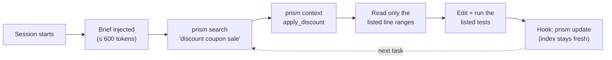
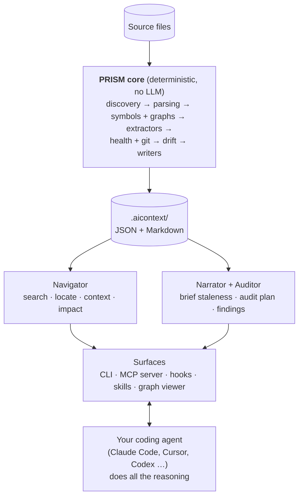

# PRISM

**A persistent, local context layer for AI coding agents.**

PRISM maps a codebase once, keeps that map fresh as the code changes, and lets any coding agent
(Claude Code, Cursor, Codex, …) jump straight to the files, functions, and line ranges a task
touches, instead of re-reading the repository at the start of every session.

- **Local and offline.** No network calls, no API keys, no telemetry. Nothing leaves your machine.
- **Deterministic.** The same code always produces the same `.aicontext/` bytes.
- **Opt-in per project and per user.** Installing PRISM changes nothing until you run `prism init`.
- **Agent-agnostic.** Plain JSON and Markdown artifacts, a CLI, an MCP server, and skills.

> **PRISM computes, the agent thinks.** PRISM does deterministic static analysis and bookkeeping.
> Anything that needs reasoning (writing the project brief, auditing code) is done by the coding
> agent you already use, through skills and tools PRISM installs. No extra service, no extra cost.

---

## Contents

- [Why PRISM](#why-prism)
- [How it works](#how-it-works)
- [Quick start](#quick-start)
- [What you get](#what-you-get)
- [Measured results](#measured-results)
- [Command overview](#command-overview)
- [Documentation](#documentation)
- [Contributing](#contributing)
- [License](#license)

## Why PRISM

Every new agent session starts blind. To change one function, an agent typically lists
directories, greps, opens whole files to find the function and its callers, and re-discovers
conventions it learned yesterday. On a mid-sized repository this orientation tax is most of a
session's tokens, and it is paid again every session.

PRISM becomes a permanent context window that lives next to the code. The agent's own context
window becomes a small, focused working set loaded on demand:



## How it works



PRISM has five pillars:

| Pillar | What it does | Who does the work |
|---|---|---|
| **Index** | Symbols, call and import graphs, PageRank importance, routes, models, config keys, tests map, health, git history | PRISM |
| **Navigator** | Budgeted *context packs*: exact location, callers, callees, tests, blast radius, a read list | PRISM |
| **Narrator** | `AGENTS.md` brief and module summaries: PRISM writes the facts, your agent writes the prose | PRISM + agent |
| **Auditor** | Prioritized audit plan, finding store and reports; your agent reviews code and proves findings | PRISM + agent |
| **Visualizer** | Interactive, Obsidian-style graph of the codebase in the browser, with live updates | PRISM |

Read the [architecture guide](docs/architecture.md) for the full picture.

## Quick start

Requirements: Python 3.10+. Git is optional (it enables churn, ownership and co-change data).

```bash
# Install (PyPI release pending; install from GitHub meanwhile)
pip install "git+https://github.com/Aashutosh-Mahajan/prism"

cd your-repo
prism init        # shows every file it will create or change and asks first
prism status      # consent state, index freshness, drift
```

`prism init` creates `.aicontext/`, adds its cache paths to `.gitignore`, records a local
per-user enable flag in `~/.config/prism/repos.toml`, optionally installs agent integrations
(skills, hooks, MCP entry), and offers to run the first scan.

Then explore:

```bash
prism search "discount applied twice"
prism context pricing.discounts.apply_discount
prism impact pricing.discounts.apply_discount
prism view        # the interactive graph in your browser
```

Optional extras:

```bash
pip install "prism-ctx[treesitter]"   # JavaScript, TypeScript, Go and Java parsing
pip install "prism-ctx[semantic]"     # local embeddings for `prism search --semantic`
```

See [Getting started](docs/getting-started.md) for a guided walkthrough.

## What you get

**For the agent**
- A compact session brief (languages, how to run tests and lint, how to use PRISM; about 100-150 tokens).
- The code a request needs, added to the prompt before the model's first turn (Claude Code, Codex,
  Gemini CLI), or one `prism task` call away: the matching code, every exact string match, call
  sites, tests and impact, within a token budget. Follow-ups via `context` / `impact`.
- Skills that teach the agent the workflow: `prism-context`, `prism-refresh`, `prism-audit`, `prism-decisions`.
- An index that is current whether or not your agent has hooks: every answer first checks the
  working tree, and hooks update it in the background after edits.

**For you**
- `prism view`: a zoomable graph from packages down to functions. Click any node for its
  signature, callers, callees, tests, risk and history; watch the agent's reads and edits light
  up live. Keyboard-accessible, dark and light themes, fully offline.
- `prism audit`: an evidence-based audit run by your own agent, with a report that diffs against
  the previous audit.
- Exports: self-contained HTML, an Obsidian vault, Mermaid, DOT, GraphML, JSON.

## Measured results

From the repeatable harness in [`tests/benchmarks/tokens.py`](tests/benchmarks/tokens.py),
counting tokens an agent reads to orient itself for realistic bug-fix requests
(details and caveats in [Benchmarks](docs/benchmarks.md)):

| Repository | Size | Without PRISM | With PRISM | Saved |
|---|---|---:|---:|---:|
| Django + React web app, 12 tasks, full session | 305 files · 50k lines | 356,657 | 28,202 | **92%** |
| PRISM itself, 10 tasks, full session | 140 files · 20k lines | 105,846 | 28,981 | **73%** |
| 12-file fixture | 119 lines | 1,115 | 3,136 | −181% |

PRISM pays off on real projects; on tiny repositories its fixed cost (brief, search, pack) is
larger than simply reading everything. Queries answer in 1–3 ms; a one-file update takes about
0.4 s on a 50k-line repository.

## Command overview

| Area | Commands |
|---|---|
| Setup and consent | `init` · `enable` / `disable` · `pause` / `resume` · `uninstall-integration` · `install --global` · `doctor` |
| Index | `scan` · `update` · `status` · `watch` · `migrate` |
| Navigation | `task` · `brief` · `search` · `locate` · `context` · `impact` · `module` |
| Narrative | `refresh prepare` · `refresh commit` · `decision add/list/show` |
| Audit | `audit plan` · `audit record` · `audit update` · `audit report` |
| Graph | `view` · `graph export` |
| Agent plumbing | `mcp` · `hook session-start` · `hook user-prompt` · `hook post-edit` |

Full reference: [CLI](docs/cli.md).

## Documentation

| Guide | What it covers |
|---|---|
| [Getting started](docs/getting-started.md) | Install, enable a repo, the daily workflow |
| [Architecture](docs/architecture.md) | Pipeline, incremental updates, package layout, design principles |
| [Local context engine](docs/context-engine.md) | Task compilation, CLI/MCP parity, persistent knowledge and session reuse |
| [Measured token savings](docs/token-saving-delivery-2026-10-08.md) | CLI/MCP preflight edit trials, provider counters, correctness and limits |
| [CLI reference](docs/cli.md) | Every command and option, exit codes |
| [The `.aicontext/` directory](docs/aicontext.md) | Artifacts, schemas, the `AGENTS.md` format |
| [Agent integrations](docs/agents.md) | Claude Code, Cursor, Codex, Gemini CLI, Antigravity, MCP tools, hooks, the consent model |
| [Graph viewer](docs/viewer.md) | Using `prism view`, shortcuts, exports, API and security |
| [Auditing](docs/audit.md) | The agent-driven audit workflow and finding schema |
| [Configuration](docs/configuration.md) | `[tool.prism]` settings and environment variables |
| [Benchmarks](docs/benchmarks.md) | How token savings and latency are measured, and results |
| [Troubleshooting](docs/troubleshooting.md) | Common problems and `prism doctor` |
| [Decision records](docs/adr/) | Why things are built the way they are |
| [Specification](CLAUDE.md) | The product specification all work is checked against |
| [Phase status](docs/phase-status.md) | Verified coverage and remaining work |

## Contributing

Contributions are welcome. Read [CONTRIBUTING.md](CONTRIBUTING.md) for the development setup,
the checks every change must pass, and the design rules PRISM will not bend (offline, no API
keys, deterministic output, opt-in). Please follow the [Code of Conduct](CODE_OF_CONDUCT.md),
and report security issues as described in [SECURITY.md](SECURITY.md).

## License

[MIT](LICENSE) © AlgoSmiths.
