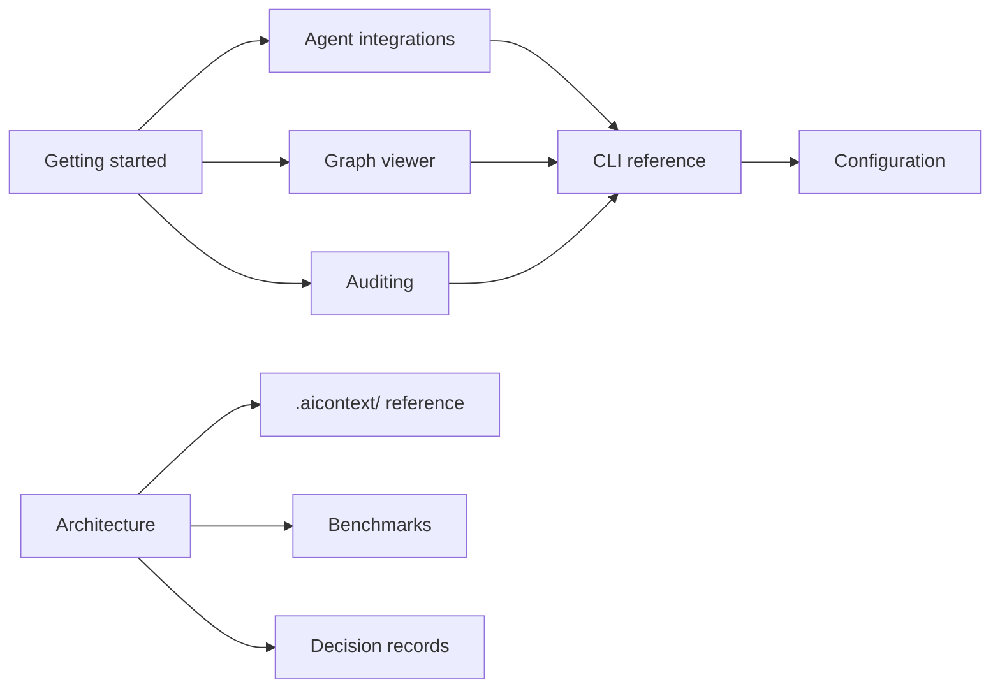

# PRISM documentation

New to PRISM? Start with [Getting started](getting-started.md).

## Using PRISM

| Guide | Read it when you want to… |
|---|---|
| [Getting started](getting-started.md) | Install PRISM, enable it in a repository, and learn the daily workflow |
| [Agent integrations](agents.md) | Understand what PRISM installs for Claude Code, Cursor or Codex, the MCP tools, hooks, skills and consent |
| [Graph viewer](viewer.md) | Explore your codebase visually with `prism view`, or export the graph |
| [Auditing](audit.md) | Have your agent audit the codebase with evidence |
| [CLI reference](cli.md) | Look up a command, an option or an exit code |
| [Configuration](configuration.md) | Tune ignores, source roots, drift threshold; environment variables |
| [Graphify integration](graphify-integration.md) | Use graph-assisted retrieval, optional exports and source-aware session memory |
| [Troubleshooting](troubleshooting.md) | Fix a setup problem |

## Understanding PRISM

| Document | Covers |
|---|---|
| [Architecture](architecture.md) | The pipeline, incremental updates, the query path, surfaces, determinism |
| [The `.aicontext/` directory](aicontext.md) | Every artifact, the `AGENTS.md` format, schemas |
| [Benchmarks](benchmarks.md) | How token savings and latency are measured, and the results |
| [Retrieval research and revision](retrieval-research-2026-10-07.md) | Changes prompted by the Plexus pilot, upstream ideas, limits and validation |
| [Retrieval reliability](retrieval-reliability-2026-10-07.md) | Fixes after the fresh campaign, frozen before/after target checks and remaining limits |
| [Decision records](adr/) | Why things are built the way they are |
| [Specification](../CLAUDE.md) | The product specification all work is checked against |
| [Phase status](phase-status.md) | Verified coverage against the roadmap and remaining work |

## Contributing

[CONTRIBUTING.md](../CONTRIBUTING.md) covers the development setup, checks, testing and design
rules. Security issues: [SECURITY.md](../SECURITY.md).

## Map

