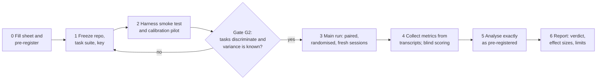
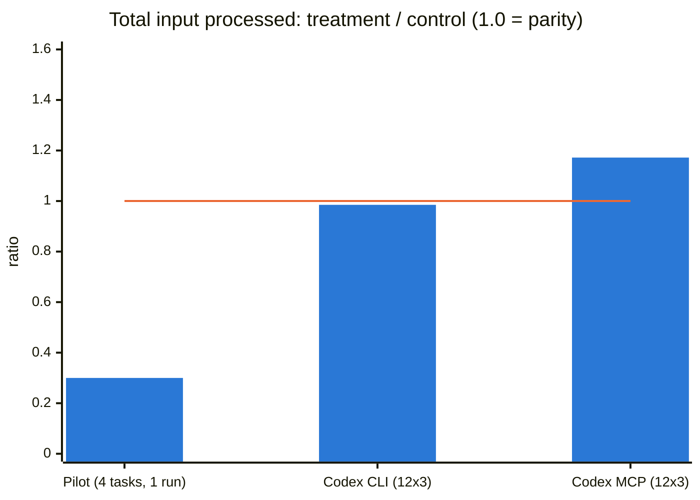
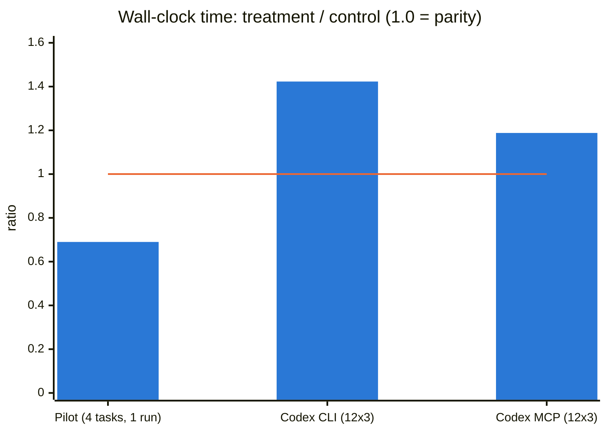
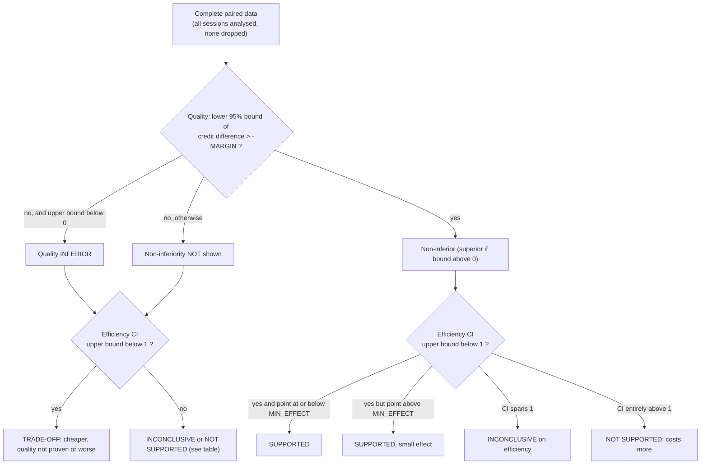
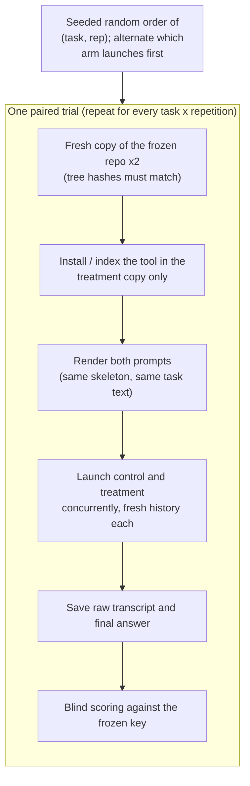
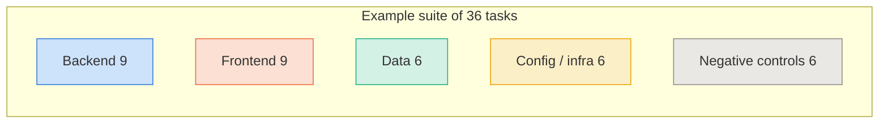
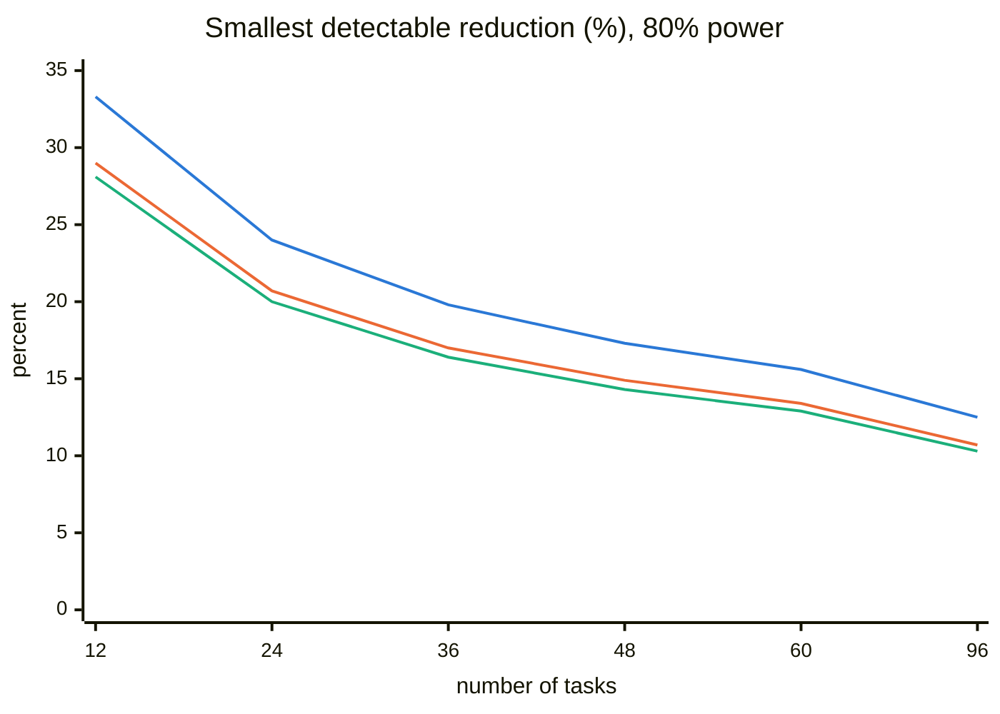
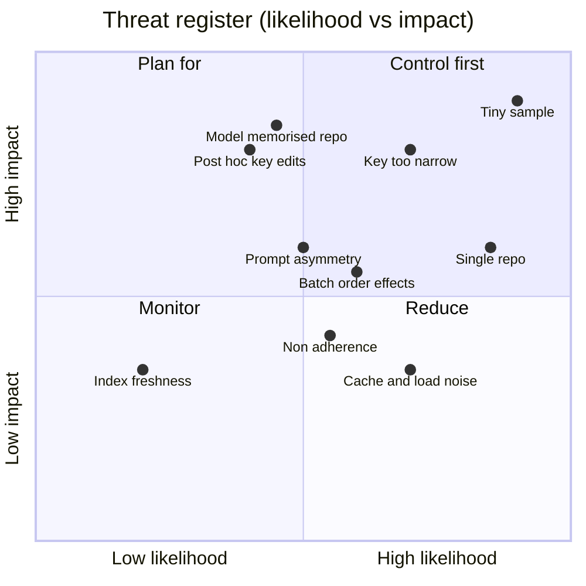
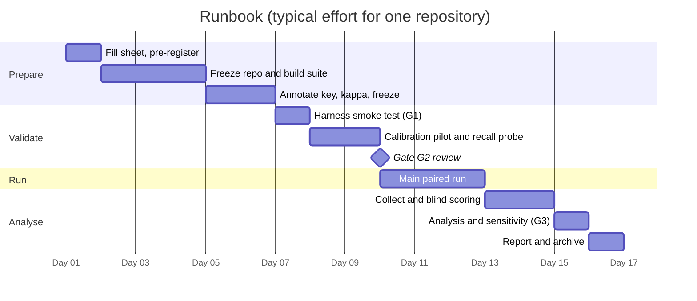

# Agent Benchmark Protocol: does tool X make a coding agent better?

**A repo-agnostic, pre-registrable A/B protocol for coding-agent tools** (code indexes, MCP servers, retrieval layers, linters-for-agents, new prompts or skills).
It replaces the PRISM-vs-baseline plan with a generic template: fill in section 0 and the same document tests *any* tool on *any* repository.

| | |
|---|---|
| Version | 2.0 (generic template), 2026-10-06 |
| Derived from | `agent-benchmark-plan.md` (PRISM on Platforma) and the two measured Codex campaigns of 2026-10-03 |
| Output of a run | the filled-in [Part II report](#part-ii-results-report-template) |
| Everything is in this file | protocol, pre-registration form, prompts, schemas, tested analysis scripts, report template |

**Contents**

- [0. Fill-in sheet](#0-fill-in-sheet)
- [1. Purpose and what you may conclude](#1-purpose-and-what-you-may-conclude)
- [2. What the PRISM pilots taught us (real data)](#2-what-the-prism-pilots-taught-us-real-data)
- [3. Hypotheses, endpoints and decision rule](#3-hypotheses-endpoints-and-decision-rule)
- [4. Experimental design](#4-experimental-design)
- [5. Subject repositories](#5-subject-repositories)
- [6. Task suite and answer key](#6-task-suite-and-answer-key)
- [7. Fairness and parity controls](#7-fairness-and-parity-controls)
- [8. Metrics catalogue](#8-metrics-catalogue)
- [9. Scoring protocol](#9-scoring-protocol)
- [10. Statistical analysis plan](#10-statistical-analysis-plan)
- [11. Threats to validity](#11-threats-to-validity)
- [12. Execution runbook and gates](#12-execution-runbook-and-gates)
- [Part II. Results report template](#part-ii-results-report-template)
- [Part III. Appendices](#part-iii-appendices)

---

## 0. Fill-in sheet

Fill this first. Every `<PLACEHOLDER>` elsewhere in the document refers to a row here. Commit the filled sheet before running anything (section 3.4).

| Placeholder | Meaning | Your value |
|---|---|---|
| `<PROJECT>` | Repository family under test | |
| `<TOOL>` | The treatment: tool, version, commit, transport (CLI, MCP, native) | |
| `<CONTROL>` | The control: the agent's normal tools, with versions | |
| `<AGENT>` / `<MODEL>` / `<EFFORT>` | Agent product, exact model id, reasoning effort, sampling settings | |
| `<REPO>` / `<SHA>` | Repository path and the frozen commit | |
| `<N_TASKS>` | Tasks per repository (minimum 24, recommended 36 to 60) | |
| `<N_REPS>` | Repetitions per task and arm (minimum 3, recommended 3 to 5) | |
| `<MODE>` | `per_task` (primary) or `batch` (secondary), section 4.2 | |
| `<PRIMARY>` | Primary efficiency endpoint (default: billable-input proxy per task) | |
| `<MIN_EFFECT>` | Smallest ratio you would call worthwhile (default 0.85) | |
| `<MARGIN>` | Non-inferiority margin on answer credit (default 0.10) | |
| `<SEED>` | Randomisation and bootstrap seed | |

---

## 1. Purpose and what you may conclude

The protocol answers two questions about a tool, on one or more repositories, for one agent and model:

1. **Efficiency.** Does the agent use fewer tokens (and less money, time and context) to reach an answer when it has `<TOOL>` than when it has `<CONTROL>`?
2. **Quality.** Is the answer at least as good: the right function, the right callers, the right tests?

It does **not** show that the tool helps on other models, other agent harnesses, other repositories, or on tasks other than *localising the code where a reported behaviour is implemented*. State that scope in every report. Generalisation needs more repositories and models (section 5).



**Five rules that make the result trustworthy**

1. Decide the analysis *before* seeing data (pre-registration, section 3.4).
2. Compare the *same task* under both arms, in fresh sessions, at the same time (paired, randomised).
3. Measure from transcripts, never from the agent's self-report.
4. Treat tasks (not sessions) as the independent units, and plan the number of tasks with a power analysis.
5. Report quality with the efficiency numbers, and say "inconclusive" when the data are.

---

## 2. What the PRISM pilots taught us (real data)

The same tool, measured three times on the same repository (Platforma, about 351 files and 50k to 60k lines), gave three different answers. This is the strongest argument for the rigour in the rest of the document.

| Campaign (2026-10-03) | Design | Input processed | Billable proxy | Tool output | Time | Primary-function score |
|---|---|---:|---:|---:|---:|---:|
| Pilot, Claude agents, CLI | 4 tasks, 1 run, 1 pair | **-70%** | -51% | -44% | -31% | same on 3 of 4 tasks |
| Codex agents, CLI | 12 tasks, 3 paired runs | **-1.5%** | -17.6% | -34.8% | **+42.3%** | 9.67 vs 9.00 of 12 |
| Codex agents, MCP | 12 tasks, 3 paired runs | **+17.2%** | +3.2% | -8.6% | **+18.8%** | 9.33 vs 8.67 of 12 |

Changes are treatment relative to control (negative = treatment used less). Sources: the three PRISM benchmark documents in `docs/`.

Bars below show the **treatment as a fraction of the control** (1.0 = parity; the orange line marks parity). Mermaid bars always start at zero, so a ratio is used rather than a signed percentage.





### 2.1 What a proper analysis says about the 12x3 CLI campaign

Applying this protocol's analysis (section 10) to the run-level totals of the Codex CLI campaign (script in Appendix C), treating each of the 3 paired runs as the cluster:

| Metric | Ratio treatment/control | 95% CI (cluster bootstrap) | Smallest attainable permutation p with 3 clusters |
|---|---:|---|---:|
| Total input processed | 0.98 | 0.75 to 1.42 | 0.25 |
| Billable proxy | 0.82 | 0.70 to 1.01 | 0.25 |
| Wall-clock time | 1.41 | 1.14 to 1.58 | 0.25 |

With only three clusters, **no result in that campaign can ever reach p < 0.05**, and the intervals are wide enough to contain both "big saving" and "no saving". The honest reading of the campaign is "inconclusive on tokens, probably slower, better caller coverage", which is *not* what the single-run pilot suggested.

### 2.2 Lessons, and the rule each one produced

| Observation in the PRISM campaigns | Problem | Rule in this protocol |
|---|---|---|
| One run of 4 tasks gave -70%; 12x3 gave -1.5% | Tiny, single-run samples swing wildly | Section 10.6: power analysis first; at least 24 tasks; report CIs |
| Each agent session handled all 12 tasks, so there were only 3 pairs per arm | Task effects and order effects were fused; n = 3 | Section 4.2: one fresh session **per task** is the primary design |
| About 78,000 (Claude) or 30,000 (Codex) tokens of fixed overhead in every context | Hides the difference when comparing "final context size" | Section 8: report overhead separately; primary metrics exclude nothing, but work-context is always shown |
| Tasks 11 and 12 were "partial" in every run of both arms | The key was too narrow: neighbouring functions (`APICache.get`, `resolvePostAuthPath`) were plausible answers | Section 6.5: adjudicate alternatives **before** the run; ceiling/floor diagnostic after |
| Alternatives for tasks 5, 6, 8 were added after the first pilot | Post-hoc key edits can favour one arm | Section 6.5: the key is frozen and hashed; any later edit is applied to both arms and reported as a sensitivity analysis |
| Caller coverage: 16.7 vs 38.7 of 76 (CLI), 23.3 vs 40.7 (MCP) | A consistent quality win, easy to miss if only tokens are reported | Section 9: caller recall is a pre-registered secondary endpoint, with an independent denominator |
| Tests named: 8.7 vs 7.3 (CLI), 9.0 vs 6.7 (MCP) | The tool had a real weakness (Django `tests.py` mapping) | Section 9: test discovery is scored as its own endpoint |
| "Tool calls" counted batched `exec` calls as one | Tool-call counts are not comparable across harnesses | Section 8.3: tool calls are diagnostic only |
| Prompts differed in navigation paragraph; first-turn contexts differed by about 0.4% to 1.5% | Small, but a hidden confound | Section 7: prompt-parity check (within 10%) and report the difference |
| Time was +42% with the tool | Index calls add latency; time depends on machine and API load | Time is secondary; pairs run concurrently; report medians |
| One-off indexing cost was excluded from totals | The tool may never pay for itself on small jobs | Section 8.4: report amortised cost and the break-even task count |

---

## 3. Hypotheses, endpoints and decision rule

### 3.1 Hypotheses

- **H1 (efficiency).** The geometric-mean ratio `<TOOL>` / `<CONTROL>` of `<PRIMARY>` is below 1 and at most `<MIN_EFFECT>` to count as worthwhile.
- **H2 (quality).** Mean answer credit with `<TOOL>` is not worse than with `<CONTROL>` by more than `<MARGIN>` (non-inferiority).
- **"No worthwhile benefit" (a finding, distinct from "inconclusive").** Declared only when the planned sample is complete and the *lower* end of the 95% interval of the primary ratio is above `<MIN_EFFECT>`: even the most favourable plausible effect is smaller than the one you said was worth having. Otherwise a wide interval is reported as inconclusive.

### 3.2 Endpoints

| Tier | Endpoint | Role |
|---|---|---|
| **Co-primary 1** | `<PRIMARY>` (default: billable-input proxy per task), ratio | H1; must hold |
| **Co-primary 2** | Mean answer credit (1, 0.5, 0), difference | H2; must hold. Both co-primaries must succeed, so no alpha split is needed |
| Secondary (Holm family) | Total input processed, work context, tool-output tokens, model turns, wall-clock time, caller recall, test recall, hallucination rate | Reported with Holm-adjusted p-values |
| Diagnostic (no inference) | Tool-call counts and mix, first-turn overhead, cache-read share, treatment adherence, output tokens, per-stratum results | Explain *why* |

### 3.3 Decision rule

The verdict is a function of two outcomes. Compute it mechanically; do not re-interpret it after seeing the data.



| Efficiency \ Quality | Superior | Non-inferior | Not shown | Inferior |
|---|---|---|---|---|
| **Clearly lower, at least MIN_EFFECT** | SUPPORTED | SUPPORTED | TRADE-OFF, quality unproven | TRADE-OFF |
| **Lower, smaller than MIN_EFFECT** | SUPPORTED (small) | SUPPORTED (small) | TRADE-OFF, quality unproven | TRADE-OFF |
| **CI spans 1** | QUALITY BENEFIT ONLY | INCONCLUSIVE on efficiency | INCONCLUSIVE | NOT SUPPORTED |
| **Clearly higher** | TRADE-OFF (costs more, better answers) | NOT SUPPORTED | NOT SUPPORTED | NOT SUPPORTED |

If the planned sample is complete and the lower end of the primary ratio's CI exceeds `<MIN_EFFECT>`, the report says "no worthwhile efficiency benefit" instead of "inconclusive".

### 3.4 Pre-registration

Fill the form in [Appendix D](#appendix-d-pre-registration-form) and commit it **before the first agent run**. After that, changes go only into the [deviations log](#appendix-e-deviations-log) with a note on whether they were decided before or after seeing outcomes. Post-hoc changes are allowed only when applied to both arms and accompanied by a sensitivity analysis.

---

## 4. Experimental design

### 4.1 Arms

| Arm | Definition | Required? |
|---|---|---|
| **Control (C)** | The agent with its normal tools, same prompt skeleton, no mention of `<TOOL>` except "do not use it" | Yes |
| **Treatment (T)** | Identical, plus `<TOOL>` installed and described in a paragraph of the same length as the control paragraph | Yes |
| **Placebo (P)** | Control plus a no-op tool or equally long, content-free instructions. Separates *the tool* from *having extra instructions or tool definitions* | Recommended |
| **Oracle (O)** | Agent is told the answer file and line range. Gives the quality ceiling and the minimum possible token cost | Optional, cheap, very informative |

The oracle and placebo arms are analysed with the same machinery (treatment = P or O, control = C).

### 4.2 Unit of analysis and session design



- **Primary design: `per_task`.** Every (task, repetition, arm) is its own fresh agent session containing one task. The independent unit is the **task**; repetitions of a task are averaged inside the task cluster. This gives `<N_TASKS>` clusters rather than `<N_REPS>`.
- **Secondary design: `batch`.** One session works all tasks in sequence (as the PRISM campaigns did). Reflects real use, where context accumulates, but fuses task and order effects and leaves only `<N_REPS>` clusters. If you run it, use a Latin-square task order across repetitions and *never* report it as the primary result.
- The fixed overhead (system prompt and tool definitions) is paid once per session, so per-task sessions inflate its share. Report overhead and work context separately (section 8).

### 4.3 Randomisation, pairing and blinding

- **Pairing.** The unit of comparison is the same `(task, repetition)` under both arms.
- **Order.** Build the schedule from `<SEED>`; shuffle `(task, repetition)` pairs; alternate which arm is launched first. Both arms of a pair run **at the same time** so API latency, rate limits and provider-side model changes hit both.
- **Fresh state.** Fresh repository copies per repetition, fresh agent history, isolated tool configuration (for example a per-run config directory so your real settings are untouched).
- **Blinding.** The scorer sees answers with arm labels removed and order shuffled. Agents never see the answer key, other tasks' results, or earlier benchmark output (exclude `.benchmark-runs`, previous reports and agent config files from the copies).

### 4.4 Repetitions

Repetitions measure run-to-run noise from sampling; they do **not** replace tasks. In the example of section 10.6 (typical between-task heterogeneity), going from 1 to 5 repetitions at 36 tasks improves the minimum detectable effect by less than 4 percentage points, while doubling the tasks (24 to 48) improves it by about 6 points. Spend your budget on **more tasks first**, then on 3 repetitions.

---

## 5. Subject repositories

| Criterion | Requirement |
|---|---|
| Frozen snapshot | One commit `<SHA>` per repository; copies are made from it |
| Realistic size | At least about 100 files and 10k lines; otherwise any agent can read everything and no tool can help |
| Tests | Some tests, so test discovery can be scored |
| Languages | Record language mix; if the tool supports several, include at least two repositories in different ecosystems |
| Several repositories | To claim anything beyond one code base, use **3 or more** repositories and analyse with a random-effects meta-analysis (section 10.5) |
| Contamination | Public repositories and well-known bug fixes may be memorised by the model. Prefer private repositories or commits after the model's training cutoff, and run the **blind recall probe** (section 6.6) |

---

## 6. Task suite and answer key

### 6.1 Task type

Each task is a **user-style symptom report** with no identifiers. The agent must find the code that implements the behaviour and is where a fix would go. Diagnosis only; no edits. (If your tool is about another job, such as editing or test generation, change the task type and the key, but keep sections 3, 4, 7, 10 as written.)

### 6.2 Where tasks come from, best first

1. **Mined fixes.** Issues or bug reports with a linked fix commit. The functions changed by the fix are an *objective* primary key, independent of any annotator's taste.
2. **Seeded bugs.** Apply a small, realistic mutation to a function in the frozen snapshot, identically for both arms. Key = the mutated function. Disclose it as synthetic.
3. **Hand-written reports.** Two annotators write the symptom and independently identify the target. Weakest; use only to fill strata.
4. **Negative controls.** Reports of behaviour that does *not* exist in the code. Correct answer is `NOT_FOUND`. They catch tools that make agents over-confident.

### 6.3 Size and stratification

Aim for `<N_TASKS>` of at least 24 (recommended 36 to 60). Balance across these strata so you can see where the tool helps or hurts:

| Stratum | Levels | Minimum share |
|---|---|---|
| Area | e.g. backend, frontend, data, config, infrastructure | each at least 15% |
| Difficulty (from the calibration pilot) | easy, medium, hard | each at least 15% |
| Blast radius (callers of the target) | low (0 to 2), medium (3 to 8), high (9 or more) | each at least 15% |
| Lexical distance (does the report share words with the target's name?) | high overlap (grep-friendly), low overlap | at least 30% low |
| Negative controls | no such behaviour | 10% to 15% |



### 6.4 Writing a bug report

- Symptoms only, in the user's words. No function, file, class or module names; no hints of the fix.
- Run the **leakage lint**: the report must not contain the target's literal name, and should repeat fewer than two thirds of the words of the target's name (otherwise a plain text search solves it and the tool cannot show value).
- Ambiguous reports are allowed (real ones are), but then the key must list every defensible target (section 6.5).

### 6.5 Building and freezing the key

1. Two annotators independently name the primary target(s) and **every defensible alternative** (neighbouring functions on the same code path, wrappers, the caller that triggers the behaviour).
2. Compute agreement on the calibration pilot (Cohen's kappa at least 0.8 on the primary target); resolve disagreements by discussion and record why.
3. List true direct callers and relevant tests from an **independent source** (static analysis plus manual check), never from the tool under test. A tool that truncates its own caller list must not set the denominator.
4. **Freeze** the key (version, date, commit, SHA-256 of the file) *before* the main run.
5. After the run, an unexpectedly accepted-or-rejected answer may prompt a key change only if (a) the reviewers are blind to which arm produced it, (b) the change is applied to every session of both arms, and (c) the result is reported as a sensitivity analysis next to the pre-registered one.
6. Ceiling/floor diagnostic: a task that every session of both arms answers identically *and* not-correctly usually means the key is too narrow. Flag it; do not silently fix it.

### 6.6 Contamination and calibration checks

- **Blind recall probe.** Run the control agent with an **empty** directory on every task. Any task it answers correctly is memorised or guessable; drop or flag it.
- **Calibration pilot.** Run 1 repetition of both arms on all tasks. Use it to (a) remove tasks that are trivially solved by both arms with a single search (keep a few as sanity anchors), (b) estimate the between-task and run-to-run standard deviations for the power analysis, (c) compute annotator agreement, (d) test the harness. Pilot data are **not** pooled into the main analysis.

---

## 7. Fairness and parity controls

| Control | How to verify |
|---|---|
| Same model, version, effort, sampling | Record exact ids in the pre-registration; check the transcript metadata |
| Same repository state | Make copies from the frozen commit; compute a tree hash of both copies **before** tool setup; they must match |
| Same exclusions | Both copies exclude dependencies, VCS data, build output, local agent config, secrets, prior benchmark output |
| Tool artefacts only in treatment | The control copy contains no index, no tool config, no instruction block mentioning the tool |
| Prompt parity | Same skeleton; only the tooling paragraph differs; paragraph lengths within 10% (estimate tokens as characters / 4) |
| Same permissions | Same allowed tools except the treatment tool; both read-only |
| Same time window | Pairs run concurrently |
| Cache state | Interleaved/concurrent runs; record cache-read share per arm; run the price-sensitivity analysis (section 10.7) |
| Isolation of tool state | Per-run config directory; never touch your real settings |
| Treatment adherence | Count sessions in which the agent never called the tool; analyse as-assigned (ITT) and per-protocol |
| Control contamination | Count control sessions that used the tool (should be 0) |
| Forbidden commands | Treatment agents must not run setup/index/update commands; count violations |
| No answer leakage | The key, task rationale and previous results live outside the copies |
| Harness validity | Smoke-test the parser on a transcript whose numbers you can verify by hand (gate G1) |

---

## 8. Metrics catalogue

All numbers come from the **transcript**. Provider differences are removed once, in the parser:

```
context(turn) = fresh_input + cache_write + cache_read
```

- Anthropic-style logs report the three terms separately.
- OpenAI-style logs report `input_tokens` *including* cached tokens: `fresh = input_tokens - cached_input_tokens`, `cache_read = cached_input_tokens`.

### 8.1 Efficiency metrics

| Metric | Definition | Why |
|---|---|---|
| **Billable-input proxy** (default primary) | `fresh + w_cw x cache_write + w_cr x cache_read`; defaults `w_cw = 1.25`, `w_cr = 0.10`. Replace with your provider's price ratios, and state them | Approximates what is paid under prompt caching |
| Cost in currency | Prices per million tokens x token counts, including **output** tokens | The real invoice, if prices are known |
| Total input processed | Sum over turns of `context(turn)` | Real volume, because every turn re-sends the whole context |
| Fixed overhead | `context` at the first turn | Same for both arms in principle; a mismatch signals prompt non-parity |
| Work context | `context(last turn) - context(first turn)` | What the work added, free of overhead |
| Tool-output tokens | Characters of tool results / 4 | How much code and search text entered the context |
| Model turns | Assistant messages that carry usage | Fewer turns = less context re-sent |
| Wall-clock time | First to last transcript timestamp | Speed; sensitive to machine and API load, so secondary |
| Output tokens | Sum of output tokens | Not free; often forgotten |

### 8.2 Quality metrics (details in section 9)

Answer credit; strict-correct rate; file-hit rate; caller recall and precision; test recall; hallucination rate; correct `NOT_FOUND` rate on negative controls.

### 8.3 Diagnostics

Tool calls by type (note: a batched shell call may hide many commands, so counts are not comparable across harnesses); treatment-tool calls per session; share of sessions that fell back to plain search; cache-read share.

### 8.4 Amortised cost and break-even

The index is built once; it is paid back only if the agent performs enough tasks on the repository.

```
break_even_tasks = index_cost / (mean_cost_per_task_control - mean_cost_per_task_treatment)
```

Report `index_cost` (tokens or seconds for building and refreshing the index) and the break-even task count. If the saving per task is zero or negative, the tool never pays back on that metric.

```
Example of reading the numbers (illustrative, not data)
  fixed overhead      |#########################             |  same in both arms
  work context (C)    |                         ##########   |  what the work added
  work context (T)    |                         #####        |  tool arm adds less
```

---

## 9. Scoring protocol

### 9.1 Final-answer format (machine-parseable)

Agents end with exactly one JSON object (schema in Appendix B). A tolerant legacy text format may be parsed, but JSON is preferred because it removes parser disagreement from the scoring.

### 9.2 Tiers and credit

| Tier | Rule | Credit |
|---|---|---:|
| **C, correct** | Primary symbol matches the key or a pre-registered alternative | 1.0 |
| **P, partial** | The expected symbol appears only as a caller or dependent of the answer | 0.5 |
| **W, wrong** | Neither | 0.0 |
| Negative control | `NOT_FOUND` = C; any concrete symbol = W | 1.0 / 0.0 |

**Matching rules.** Compare qualified names and **require the owner for methods** (`A.get_object` must not match `B.get_object`). A bare name matches only if the same file is given. Where a range is given, accept at least 50% overlap with the key range. A session that crashes, times out, or returns no parseable answer is **scored W with the tokens it consumed**; it is never dropped.

### 9.3 Secondary quality endpoints

| Endpoint | Definition | Caveat |
|---|---|---|
| Caller recall | Share of the key's true direct callers named | Denominator from independent static analysis, not from the tool |
| Caller precision | Share of named callers that are real | Catches padding |
| Test recall | Did the agent name at least one test that exercises the target? | Two levels: *exists* (name matches a real test) and *covers* (verified by coverage or by running it). Report which you used |
| Hallucination rate | Share of named symbols or locations that do not exist | Verify automatically against the snapshot |
| File-hit rate | Right file, regardless of function | Shows near-misses |
| Localisation error | Distance in lines or functions between answer and key, when wrong | Optional |

### 9.4 Who scores

Automatic matching first. Any answer the matcher cannot decide goes to a human (or a calibrated LLM judge, validated against human labels with kappa at least 0.8 on a 20% sample) who sees **arm-blind, shuffled** answers.

---

## 10. Statistical analysis plan

### 10.1 Principles

- Compare **pairs**: the same task and repetition under both arms.
- The **independent unit** (cluster) is the task in `per_task` mode, or the repetition in `batch` mode. Repetitions of one task are not independent; average or resample within the cluster.
- Ratio metrics (tokens, time, cost) are analysed on the log scale and reported as the **geometric mean of paired ratios**. Quality credit is analysed as a difference.
- **Intention-to-treat** is primary: every assigned session counts, whether or not the agent used the tool. Per-protocol (only sessions that used it) is reported as a sensitivity analysis.

### 10.2 Estimation and tests

| Item | Method |
|---|---|
| Point estimate | Mean over clusters of the within-cluster mean of the paired log-ratio (or difference), back-transformed |
| 95% CI | **Two-stage cluster bootstrap**: resample clusters, then resample repetitions inside each chosen cluster; at least 5,000 resamples; fixed `<SEED>` |
| p-value | **Exact sign-flip permutation test** on cluster means (up to 14 clusters; Monte-Carlo above) |
| Check | Wilcoxon signed-rank on cluster means when there are at least 6 clusters |
| Effect size | Ratio (headline), standardised paired effect `d_z`, and win rate (share of clusters where the treatment is better) |
| Multiplicity | Co-primaries must both succeed (no correction). Secondaries: **Holm** within the secondary family |
| Quality non-inferiority | Lower bound of the 95% CI of the credit difference above `-<MARGIN>` |
| Strict-correct sign test | Exact binomial on discordant pairs (descriptive; ignores clustering) |

**Minimum attainable p-value.** With `k` clusters a sign-flip test cannot return a p-value below `2 / 2^k` (0.25 for k = 3; 0.002 for k = 10; below 0.001 for k at least 11). Report it next to every p-value from a small design.

### 10.3 Heterogeneity

Report results by stratum (section 6.3) and by repository, with a forest plot. A tool that helps on high-blast-radius tasks and hurts on easy ones is a different finding from one that helps uniformly. Strata results are **exploratory**; they motivate follow-up experiments and are not used for the verdict.

### 10.4 Reliability of the measurement

Report ICC(1) across repetitions of the primary metric and the mean within-task coefficient of variation. ICC near 1 means tasks dominate and repetitions agree (add tasks); ICC near 0 means run noise dominates (add repetitions or tighten sampling settings).

### 10.5 Several repositories

Compute the log-ratio per repository, then combine with a random-effects meta-analysis (DerSimonian-Laird). Report the pooled ratio, its CI, tau-squared, and I-squared. Do not pool raw sessions across repositories.

### 10.6 Power and sample size (plan before running)

Between-task heterogeneity of the effect (`sd_task`) and run-to-run noise (`sd_rep`), both on the natural-log-ratio scale, set the achievable precision:

```
SE(mean log ratio)  =  sqrt( (sd_task^2 + sd_rep^2 / reps) / tasks )
Minimum detectable log ratio (80% power, two-sided 5%)  ~=  (t_{0.975, tasks-1} + 0.84) x SE
```

Estimate `sd_task` and `sd_rep` in the calibration pilot. The table uses typical agent values `sd_task = 0.35`, `sd_rep = 0.30`.

| Tasks | Reps = 1 | Reps = 3 | Reps = 5 |
|---:|---:|---:|---:|
| 12 | 33% | 29% | 28% |
| 24 | 24% | 21% | 20% |
| 36 | 20% | 17% | 16% |
| 48 | 17% | 15% | 14% |
| 60 | 16% | 13% | 13% |
| 96 | 12.5% | 11% | 10% |

Cells are the **smallest reduction in the primary metric detectable with 80% power**. Tasks matter more than repetitions.



Blue line: 1 repetition. Orange: 3. Green: 5. (The three lines nearly coincide above 36 tasks: that is the point.)

**Non-inferiority needs even more tasks.** Probability of *demonstrating* non-inferiority when the true difference is zero (baseline accuracy 0.75, task-level SD 0.25, simulated):

| Tasks | Reps = 1 | Reps = 3 | Reps = 5 | Reps = 3, margin 0.05 |
|---:|---:|---:|---:|---:|
| 12 | 0.11 | 0.18 | 0.28 | 0.08 |
| 24 | 0.12 | 0.32 | 0.48 | 0.12 |
| 36 | 0.18 | 0.46 | 0.67 | 0.16 |
| 60 | 0.28 | 0.66 | 0.86 | 0.22 |

With 12 tasks you can say "no evidence of quality loss"; you cannot say "equivalent quality". Do not use the word *equivalent* unless the interval supports it. (These simulated powers depend on the assumed baseline and SD; recompute with your pilot values.)

### 10.7 Sensitivity analyses (all pre-declared)

| # | Analysis | What it protects against |
|---|---|---|
| 1 | Price-ratio sweep: `w_cr` in 0.05, 0.10, 0.25, 1.0 (no caching) | Dependence on one caching assumption |
| 2 | Per-protocol (only sessions that used the tool) | Dilution by non-adherence |
| 3 | Strict key (primary targets only) vs key with alternatives | Key generosity |
| 4 | Leave-one-task-out and leave-one-stratum-out | One influential task |
| 5 | Drop the first repetition | Cold-start effects |
| 6 | Trim the longest 5% of sessions by tokens | Runaway sessions |
| 7 | Work-context instead of total input | Fixed-overhead effects |
| 8 | Include the placebo arm as the reference | Instruction-overhead effects |

A conclusion that flips under a pre-declared sensitivity analysis is reported as **fragile**.

### 10.8 Missing and failed sessions

Never drop a session for being bad. A timeout, crash or malformed answer is a result (W, with consumed tokens). Exclude a pair only for an infrastructure fault that occurred **before the first model turn**, and exclude *both* arms of the pair. List every exclusion.

---

## 11. Threats to validity



| Threat | Why it matters | Mitigation |
|---|---|---|
| Tiny sample or single run | Intervals are unreliable; results flip between runs (section 2) | Power analysis; at least 24 tasks; per-task sessions |
| Key too narrow or biased | Penalises defensible answers; ceiling/floor tasks | Two annotators, alternatives frozen before the run, diagnostic after |
| Post-hoc key edits | Can favour one arm | Blind adjudication, apply to both arms, report as sensitivity analysis |
| Prompt asymmetry | Different overhead and instructions confound the tool | Parity check within 10%; placebo arm |
| Model memorised the repository | Tasks solved without tools | Blind recall probe; private repos or post-cutoff commits |
| Batch order effects | Earlier tasks change later behaviour | Per-task sessions primary; Latin square for batch |
| Non-adherence | Agent ignores the tool, diluting the effect | ITT plus per-protocol; log adherence |
| Provider load and caching | Time and cost noise | Concurrent pairs; medians; price sweep |
| Single repository | No generalisation | 3 or more repos; meta-analysis |
| Index freshness | A stale index misleads the agent | Index the frozen copy; verify with the tool's status command before each run |
| Harness bug | Wrong numbers with great confidence | Gate G1: hand-verify one transcript; unit-test the parser |
| Researcher degrees of freedom | Choosing metrics after the fact | Pre-registration; deviations log; full tables in the report |
| Tool evolves during the study | Not measuring one thing | Freeze the tool version; record it |
| Self-report trusted | Agents miscount their own tool calls | Metrics only from transcripts |

---

## 12. Execution runbook and gates



| Gate | Passes when | If it fails |
|---|---|---|
| **G0 Pre-registered** | Section 0 sheet and Appendix D committed and timestamped | Do not start |
| **G1 Harness valid** | Parser output matches a hand count on one transcript; scorer passes unit tests on synthetic answers; copies hash-identical; treatment tool works in its copy and is absent in the control | Fix the harness |
| **G2 Suite valid** | Annotator kappa at least 0.8; no leakage lint errors; recall probe flags removed; at least 15% of tasks in each difficulty band; `sd_task` and `sd_rep` measured; power analysis meets the target | Rebuild tasks; revisit `<N_TASKS>` |
| **G3 Analysis faithful** | The analysis script was run unchanged from the pre-registered version; every deviation is logged | Re-run or label results exploratory |
| **G4 Report complete** | All required tables, figures, limitations and the raw data archive exist | Do not publish a verdict |

### 12.1 Setup recipe (adapt paths)

```bash
BENCH=~/agentbench/<PROJECT>; mkdir -p "$BENCH"
# one fresh pair of identical copies per repetition (repeat for rep in 1..N_REPS)
for arm in control treatment; do
  mkdir -p "$BENCH/rep$REP/$arm/repo"
  tar --exclude=node_modules --exclude=.git --exclude=.venv --exclude=venv \
      --exclude=dist --exclude=build --exclude=__pycache__ --exclude=.env \
      --exclude=.benchmark-runs -C <REPO> -cf - . | tar -C "$BENCH/rep$REP/$arm/repo" -xf -
done
# the copies must be identical BEFORE the tool is installed
diff -r "$BENCH/rep$REP/control/repo" "$BENCH/rep$REP/treatment/repo" && echo "copies identical"
# install / index the tool in the TREATMENT copy only, with an isolated config directory
#   <TOOL setup commands>   e.g. TOOL_CONFIG_HOME="$BENCH/rep$REP/cfg" <tool> init ... && <tool> scan
# verify the tool reports a healthy, fresh state, and that it is absent from the control copy
```

Launch both arms of each scheduled pair at the same time, each in a fresh session, and store transcripts as:

```
runs/rep<N>/<arm>/<task>/transcript.jsonl        arm = control | treatment
runs/rep<N>/<arm>/<task>/answer.json             optional; otherwise the final message is parsed
```

Then: `python measure.py runs/ > metrics.csv`, score answers into `scores.csv`, and run `python analyze.py metrics.csv scores.csv --primary billable` (Appendix C).

---

# Part II. Results report template

Copy this part into a new file for each study and fill it from the analysis output. Every number comes from `metrics.csv`, `scores.csv` and `analyze.py`. Delete the guidance in *italics*.

## R1. Verdict

> **<VERDICT CODE from section 3.3>.** <One sentence in plain words.>

| | Result |
|---|---|
| Primary efficiency ratio (`<PRIMARY>`, T/C) | `<x.xx>` (95% CI `<lo>` to `<hi>`), `<k>` clusters, permutation p = `<p>` (smallest attainable `<min_p>`) |
| Quality (credit, T minus C) | `<+/-x.xxx>` (95% CI `<lo>` to `<hi>`); non-inferiority margin `-<MARGIN>`: `<met / not met>` |
| Worthwhile effect (`<MIN_EFFECT>`) | `<reached / not reached / not excluded>` |
| Validity warnings | `<n>`; see R7 |

*State the scope in one line: agent, model, repositories, task type. Do not generalise beyond it.*

## R2. Study set-up (copy from the pre-registration)

| Item | Value |
|---|---|
| Tool and version / control | `<TOOL>` / `<CONTROL>` |
| Agent, model, effort | `<AGENT>`, `<MODEL>`, `<EFFORT>` |
| Repositories (commit, files, lines) | |
| Design, tasks, repetitions, sessions per arm | `<MODE>`, `<N_TASKS>`, `<N_REPS>`, |
| Key version and hash; annotator kappa | |
| Randomisation seed; schedule file | `<SEED>` |
| Deviations from the pre-registration | `<none / see log>` |

## R3. Headline numbers

*Ratios are treatment / control, geometric mean of paired ratios; below 1.00 the treatment uses less.*

| Metric | Control mean | Treatment mean | Ratio | 95% CI | p (perm.) | p (Holm) | Treatment lower in |
|---|---:|---:|---:|---|---:|---:|---:|
| Billable-input proxy (primary) | | | | | | n/a | % of clusters |
| Total input processed | | | | | | | |
| Work context | | | | | | | |
| Tool-output tokens | | | | | | | |
| Model turns | | | | | | | |
| Wall-clock time | | | | | | | |
| Cost in currency (if priced) | | | | | | | |

**Figures to include.** (1) Forest plot of the ratios on a log axis with a reference line at 1. (2) Paired slope chart per task for the primary metric (control to treatment, one line per task). (3) Overhead plus work-context stacked bars. (4) Tool-call mix by arm.

Chart template for the forest plot's data (copy into a mermaid block after replacing the values; the values are percent change):

```text
xychart-beta
    title "Treatment vs control: change in each metric (%)"
    x-axis ["Billable", "Total input", "Work ctx", "Tool output", "Turns", "Time"]
    y-axis "percent change" -100 --> 100
    bar [<v1>, <v2>, <v3>, <v4>, <v5>, <v6>]
```

## R4. Answer quality

| | Control | Treatment | Difference (95% CI) |
|---|---:|---:|---|
| Mean credit | | | |
| Strict-correct rate | | | |
| Caller recall | | | |
| Caller precision | | | |
| Test recall (`exists` / `covers`) | | | |
| Hallucination rate | | | |
| Correct `NOT_FOUND` on negative controls | | | |
| File-hit rate | | | |

Discordant strict-correct pairs (control only / treatment only): `<b> / <c>`, exact sign test p = `<p>`.

**Figures to include.** (5) Tier shares (C / P / W) per arm. (6) Per-task heat map: rows = tasks, columns = arm x repetition, cell = tier letter *and* colour. (7) Cost-versus-quality scatter, one point per repetition and arm means as diamonds.

```text
pie showData
    title Answer tiers, <arm>
    "Correct" : <n_C>
    "Partial" : <n_P>
    "Wrong" : <n_W>
```

**Key-quality flags.** Tasks answered identically non-correct by every session: `<list>`. Any key change after freezing: `<none / described, applied to both arms>`.

## R5. Where it helps and hurts (exploratory)

| Stratum | Tasks | Ratio T/C (primary) | Credit difference |
|---|---:|---|---|
| Area: `<...>` | | | |
| Difficulty: easy / medium / hard | | | |
| Blast radius: low / medium / high | | | |
| Lexical distance: high overlap / low overlap | | | |
| Negative controls | | | |

*Strata are hypothesis-generating. They do not change the verdict.*

## R6. Sensitivity analyses (section 10.7)

| # | Analysis | Primary ratio (95% CI) | Quality difference | Conclusion changes? |
|---|---|---|---|---|
| 1 | Price-ratio sweep (`w_cr` 0.05, 0.10, 0.25, 1.0) | | | |
| 2 | Per-protocol | | | |
| 3 | Strict key | | | |
| 4 | Leave-one-task-out (range of ratio) | | | |
| 5 | Drop first repetition | | | |
| 6 | Trim longest 5% | | | |
| 7 | Work context instead of total input | | | |
| 8 | Placebo arm as reference | | | |

*A verdict that flips in any row is reported as fragile.*

## R7. Validity checks

| Check | Result | Pass? |
|---|---|---|
| Copies hash-identical before tool setup | | |
| Prompt-length parity (difference, limit 10%) | | |
| First-turn context difference between arms | | |
| Sessions using the tool (treatment) / control sessions using it | `<n/N>` / `<n/N>` | |
| Forbidden-command violations | | |
| Failed or timed-out sessions (per arm; all kept) | | |
| Independent clusters, and smallest attainable p | | |
| Blind recall probe: tasks removed | | |
| Harness hand-check (G1) | | |

## R8. Reliability

| Arm | ICC(1) across repetitions (primary metric) | Mean within-task CV |
|---|---:|---:|
| Control | | |
| Treatment | | |

## R9. Index cost and break-even

| Item | Value |
|---|---|
| Index build cost (tokens / seconds) | |
| Refresh cost per change | |
| Mean saving per task on the primary metric | |
| Break-even number of tasks | |

## R10. Limitations (always include)

*Write these in the report itself. Typical entries: one agent and model; one or few repositories; localisation tasks only; key reflects the annotators' judgement; the tool and the agent harness will change; time is affected by provider load; synthetic or seeded bugs, if used.*

## R11. Reproducibility manifest and archive

| Item | Value |
|---|---|
| Analysis script version and hash; seed; resamples | |
| Python and library versions | |
| Raw transcripts, final answers, schedule, key, tree hashes, `metrics.csv`, `scores.csv` | archived at `<location>` |

## R12. Wording guide for claims

| Situation | Say | Do not say |
|---|---|---|
| CI of ratio excludes 1 and is below `<MIN_EFFECT>` | "reduced `<metric>` by `<x%>` (95% CI `<a>` to `<b>`)" | "tripled efficiency" |
| CI spans 1 | "no efficiency difference could be shown with `<k>` tasks" | "no difference" |
| CI lower bound above `<MIN_EFFECT>` after the full planned sample | "no worthwhile efficiency benefit" | "does not work" |
| Non-inferiority met | "quality was not worse by more than `<MARGIN>`" | "same quality" |
| Non-inferiority not shown | "parity on quality was not demonstrated" | "quality is worse" |
| Only a few tasks | "inconclusive; the design could not reach p < 0.05" | any significance claim |
| Result from one repository | "on `<repo>`" | "on codebases" |

---

# Part III. Appendices

## Appendix A. Prompt templates

Both arms use the **same skeleton**. Only the tooling paragraph differs, and the two paragraphs should be about the same length.

### A.1 Common skeleton

```text
You are a coding agent taking part in a benchmark. Work ONLY inside this repository copy:
<REPO_COPY>

<TOOLING PARAGRAPH>

Rules for everyone in this benchmark:
- Do NOT edit, create or delete any files. Diagnosis only.
- Do not look outside the repository directory above. Do not use subagents.
- Be efficient: read only what you need to answer confidently.
- If the reported behaviour does not exist in this code base, answer NOT_FOUND instead of guessing.

TASKS (user-reported symptoms; a report may or may not describe a real bug. Your job is to find the
code that implements the behaviour and is where a fix would go):
<TASK LIST OR SINGLE TASK>

FINAL ANSWER FORMAT. Finish with exactly one JSON object in a ```json fenced block, nothing after it:
<schema from Appendix B.3>
```

### A.2 Control paragraph

```text
Use your normal tools (file search, text search, file read, and read-only shell commands such as ls) to
explore and understand the code, the way you usually would. Do not use any tool or command called <TOOL>.
```

### A.3 Treatment paragraph (same length)

```text
This repository is set up with <TOOL>. Use it to navigate the code instead of exploring by hand:
- <how to call it: exact commands or tool names, including any config path or environment variable>
- <the recommended first call and the recommended follow-up call>
- You may fall back to your normal search and read tools if <TOOL> does not lead you to the answer.
- Never run setup, indexing or update commands for <TOOL>.
```

*Do not coach beyond what a real user's installed instructions would say. Coaching the treatment arm measures the coach, not the tool. Likewise, tell the control arm nothing about the tool except that it must not use it.*

## Appendix B. Schemas

### B.1 Task suite (`tasks.json`, shown to the experimenter and rendered into prompts)

```json
{
  "suite": {"name": "<PROJECT> localisation suite", "version": "v1", "frozen_on": "YYYY-MM-DD"},
  "tasks": [
    {"id": "T01", "category": "backend", "difficulty": "easy", "request": "Symptom only, user's words."},
    {"id": "T02", "category": "frontend", "difficulty": "hard", "request": "..."}
  ]
}
```

### B.2 Answer key (`answer_key.json`, never shown to agents)

```json
{
  "key_version": "v1",
  "frozen_on": "YYYY-MM-DD",
  "repo_commit": "<SHA>",
  "sha256_of_this_file_recorded_in": "PREREGISTRATION",
  "annotators": ["A", "B"],
  "tasks": {
    "T01": {
      "provenance": "fix commit <sha> (preferred) or annotators A+B, kappa 0.9",
      "primary": [{"symbol": "pkg.module.Class.method", "file": "pkg/module.py", "start": 10, "end": 42}],
      "accepted_alternatives": [{"symbol": "pkg.module.helper", "file": "pkg/module.py", "start": 50, "end": 61,
                                  "why": "agreed by both annotators before any run"}],
      "callers": ["pkg.api.view", "pkg.cli.main"],
      "tests": ["tests/test_module.py::TestClass"]
    },
    "T09": {"provenance": "verified absent by both annotators", "negative_control": true,
            "primary": [], "accepted_alternatives": [], "callers": [], "tests": []}
  }
}
```

### B.3 Agent final answer

```json
{
  "answers": [
    {
      "task": "T01",
      "primary": {"symbol": "<fully qualified name, or NOT_FOUND>", "file": "<path>", "start": 0, "end": 0},
      "why": "<one sentence>",
      "callers": ["<qualified names of direct callers or dependents to check>"],
      "tests": ["<existing tests worth running, or an empty list>"]
    }
  ]
}
```

### B.4 Tables the scripts exchange

| File | Columns |
|---|---|
| `metrics.csv` | `rep, arm, task, turns, tool_calls, total_input, billable, first_ctx, last_ctx, work_ctx, output_tokens, tool_out_tokens, seconds, treatment_calls, violations` |
| `scores.csv` | `rep, arm, task, credit` (1, 0.5, 0), optionally `tier, caller_recall, tests_found, category, difficulty` |
| `schedule.csv` | `order, rep, task, launch_first` |

In `batch` mode use `task = ALL` in `metrics.csv` and one row per task in `scores.csv`.

## Appendix C. Analysis scripts (tested)

Both scripts need Python 3.9 or newer with `numpy` and `pandas`. They were run end to end on a synthetic campaign of 24 tasks x 3 repetitions x 2 arms (144 transcripts) and produced consistent results. Replace the tool-specific regular expressions at the top of `measure.py`. For a provider other than Claude-style logs, only `usage_of()` needs to change.

### C.1 `measure.py`: transcripts to `metrics.csv`

```python
#!/usr/bin/env python3
"""measure.py - turn agent transcripts into one metrics row per session.

Layout expected:   runs/rep<N>/<arm>/<task>/transcript.jsonl      (arm = control | treatment)
Usage:             python measure.py runs/ > metrics.csv
Token model:       context(turn) = fresh_input + cache_write + cache_read
Provider switch:   edit usage_of() only. Claude Code reports the three numbers separately; OpenAI-style logs report
                   input_tokens INCLUDING cached tokens, so fresh = input_tokens - cached_input_tokens.
"""
import csv, json, re, sys
from datetime import datetime
from pathlib import Path

CHARS_PER_TOKEN = 4
W_CACHE_WRITE, W_CACHE_READ = 1.25, 0.10          # billable proxy; replace with your provider's price ratios
TREATMENT_RE = re.compile(r"mytool", re.I)         # what a call to the tool under test looks like
FORBIDDEN_RE = re.compile(r"mytool (init|scan|update|enable)", re.I)


def usage_of(msg):                                 # -> (fresh, cache_write, cache_read, output) or None
    u = msg.get("usage") or {}
    if not u:
        return None
    return (int(u.get("input_tokens") or 0), int(u.get("cache_creation_input_tokens") or 0),
            int(u.get("cache_read_input_tokens") or 0), int(u.get("output_tokens") or 0))


def ts(rec):
    try:
        return datetime.fromisoformat(rec["timestamp"].replace("Z", "+00:00")).timestamp()
    except Exception:
        return None


def session_row(path):
    turns, seen, calls, tool_chars, stamps, viol, treat = [], set(), 0, 0, [], 0, 0
    for line in open(path, encoding="utf-8"):
        try:
            rec = json.loads(line)
        except ValueError:
            continue
        stamps.append(ts(rec))
        msg = rec.get("message")
        if not isinstance(msg, dict):
            continue
        if rec.get("type") == "assistant":
            u = usage_of(msg)
            if u and msg.get("id") not in seen:            # one API response is logged over several lines
                seen.add(msg.get("id"))
                turns.append(u)
            for b in msg.get("content") or []:
                if isinstance(b, dict) and b.get("type") == "tool_use":
                    calls += 1
                    text = f"{b.get('name')} {json.dumps(b.get('input'))}"
                    treat += bool(TREATMENT_RE.search(text))
                    viol += bool(FORBIDDEN_RE.search(text))
        elif rec.get("type") == "user" and isinstance(msg.get("content"), list):
            for b in msg["content"]:
                if isinstance(b, dict) and b.get("type") == "tool_result":
                    c = b.get("content")
                    tool_chars += len(c) if isinstance(c, str) else sum(len(x.get("text", "")) for x in c or [] if isinstance(x, dict))
    ctx = [f + w + r for f, w, r, _ in turns]
    stamps = [s for s in stamps if s]
    return {
        "turns": len(turns), "tool_calls": calls, "total_input": sum(ctx),
        "billable": round(sum(f + w * W_CACHE_WRITE + r * W_CACHE_READ for f, w, r, _ in turns)),
        "first_ctx": ctx[0] if ctx else 0, "last_ctx": ctx[-1] if ctx else 0,
        "work_ctx": ctx[-1] - ctx[0] if ctx else 0, "output_tokens": sum(t[3] for t in turns),
        "tool_out_tokens": tool_chars // CHARS_PER_TOKEN,
        "seconds": round(max(stamps) - min(stamps), 1) if stamps else "",
        "treatment_calls": treat, "violations": viol,
    }


if __name__ == "__main__":
    root = Path(sys.argv[1])
    rows = []
    for t in sorted(root.glob("rep*/*/*/transcript.jsonl")):
        rep, arm, task = int(t.parts[-4][3:]), t.parts[-3], t.parts[-2]
        rows.append({"rep": rep, "arm": arm, "task": task, **session_row(t)})
    w = csv.DictWriter(sys.stdout, fieldnames=list(rows[0]))
    w.writeheader()
    w.writerows(rows)
```

### C.2 `analyze.py`: paired statistics and the pre-registered verdict

```python
#!/usr/bin/env python3
"""analyze.py - paired analysis exactly as pre-registered.

Inputs   metrics.csv : rep,arm,task,<metric columns>     (one row per session; from measure.py)
         scores.csv  : rep,arm,task,credit               (1 correct / 0.5 partial / 0 wrong; from your scoring step)
Usage    python analyze.py metrics.csv scores.csv --primary billable --margin 0.10 --min-ratio 0.85
Method   cluster = task (or repetition when only whole-batch sessions exist). Ratios on the log scale.
         95% CI: two-stage cluster bootstrap. p: exact / sign-flip permutation test on cluster means. Holm for secondaries.
"""
import argparse, itertools, math
import numpy as np
import pandas as pd

SEED = 20261006
rng = np.random.default_rng(SEED)
METRICS = ["billable", "total_input", "work_ctx", "tool_out_tokens", "turns", "tool_calls", "seconds"]


def pairs(df, col):
    w = df.pivot_table(index=["task", "rep"], columns="arm", values=col, aggfunc="mean")
    return w[["control", "treatment"]].dropna().reset_index()


def estimate(df, col, ratio=True, B=5000):
    p = pairs(df, col)
    if ratio:
        p = p[(p.control > 0) & (p.treatment > 0)]
        e = np.log(p.treatment / p.control)
    else:
        e = p.treatment - p.control
    p = p.assign(e=e)
    key = "task" if p.task.nunique() > 1 else "rep"
    groups = [g.e.to_numpy() for _, g in p.groupby(key)]
    k = len(groups)
    cm = np.array([g.mean() for g in groups])
    boots = np.empty(B)
    for b in range(B):                                    # resample clusters, then repetitions inside each
        boots[b] = np.mean([(lambda g: g[rng.integers(0, len(g), len(g))].mean())(groups[i]) for i in rng.integers(0, k, k)])
    lo, hi = np.quantile(boots, [0.025, 0.975])
    if k <= 14:                                           # exact sign-flip test
        signs = np.array(list(itertools.product([-1, 1], repeat=k)))
        stat = np.abs((signs * cm).mean(1))
        pval = float((stat >= abs(cm.mean()) - 1e-12).mean())
    else:
        signs = rng.choice([-1, 1], size=(20000, k))
        pval = float((1 + (np.abs((signs * cm).mean(1)) >= abs(cm.mean()) - 1e-12).sum()) / 20001)
    f = math.exp if ratio else (lambda x: x)
    return dict(point=f(cm.mean()), lo=f(lo), hi=f(hi), p=pval, clusters=k, min_p=2 / 2 ** k,
                win=float((cm < 0).mean() if ratio else (cm > 0).mean()),
                c=p.control.mean(), t=p.treatment.mean())


def holm(ps):
    order = sorted(ps, key=ps.get)
    out, run = {}, 0.0
    for i, k in enumerate(order):
        run = max(run, min(1.0, (len(order) - i) * ps[k]))
        out[k] = run
    return out


if __name__ == "__main__":
    ap = argparse.ArgumentParser()
    ap.add_argument("metrics"); ap.add_argument("scores")
    ap.add_argument("--primary", default="billable"); ap.add_argument("--margin", type=float, default=0.10)
    ap.add_argument("--min-ratio", type=float, default=0.85)
    a = ap.parse_args()
    m, s = pd.read_csv(a.metrics, dtype={"task": str}), pd.read_csv(a.scores, dtype={"task": str})
    est = {c: estimate(m, c) for c in METRICS if c in m}
    adj = holm({c: e["p"] for c, e in est.items() if c != a.primary})
    print("| metric | control | treatment | ratio T/C | 95% CI | p | p Holm | clusters | min possible p |\n|---|---:|---:|---:|---|---:|---:|---:|---:|")
    for c, e in est.items():
        print(f"| {c}{' (primary)' if c == a.primary else ''} | {e['c']:,.1f} | {e['t']:,.1f} | {e['point']:.3f} | "
              f"{e['lo']:.3f}-{e['hi']:.3f} | {e['p']:.3f} | {'-' if c == a.primary else f'{adj[c]:.3f}'} | {e['clusters']} | {e['min_p']:.3f} |")
    acc = estimate(s.assign(task=s.task), "credit", ratio=False)
    non_inf, superior, inferior = acc["lo"] > -a.margin, acc["lo"] > 0, acc["hi"] < 0
    print(f"\nQuality: mean credit control {acc['c']:.3f}, treatment {acc['t']:.3f}; diff {acc['point']:+.3f} "
          f"(95% CI {acc['lo']:+.3f} to {acc['hi']:+.3f}); non-inferior at margin -{a.margin}: {non_inf}; superior: {superior}")
    p = est[a.primary]
    eff = "better" if p["hi"] < 1 and p["point"] <= a.min_ratio else "better_small" if p["hi"] < 1 else "worse" if p["lo"] > 1 else "inconclusive"
    qual = "superior" if superior else "non_inferior" if non_inf else "inferior" if inferior else "not_shown"
    print(f"Pre-registered outcome: efficiency={eff}, quality={qual}")
    if p["clusters"] < 8:
        print(f"WARNING: only {p['clusters']} independent clusters; smallest attainable p is {p['min_p']:.3f}. Do not claim significance.")
```

Example output on the synthetic validation campaign (invented data, shown only so you can recognise the format):

```text
| metric | control | treatment | ratio T/C | 95% CI | p | p Holm | clusters | min possible p |
| billable (primary) | 108,581.5 | 61,663.3 | 0.585 | 0.540-0.635 | 0.000 | - | 24 | 0.000 |
Quality: mean credit control 0.903, treatment 0.931; diff +0.028 (95% CI -0.049 to +0.104); non-inferior at margin -0.1: True
Pre-registered outcome: efficiency=better, quality=non_inferior
```

## Appendix D. Pre-registration form

Commit before the first agent run.

| Field | Entry |
|---|---|
| Date, author, independent reviewer | |
| Tool under test (exact version, commit, transport) | |
| Control definition (tools, versions) | |
| Agent, exact model id, effort, sampling settings, harness version | |
| Repository(ies), commit SHA(s), size (files, lines), languages | |
| Task suite version; answer-key version and SHA-256 | |
| Annotators and kappa on the calibration pilot | |
| Design: `per_task` or `batch`; tasks; repetitions; seed | |
| Arms (control, treatment, placebo?, oracle?) | |
| Co-primary endpoints and `<MIN_EFFECT>`, `<MARGIN>` | |
| Secondary endpoints (Holm family) | |
| Diagnostic endpoints | |
| Analysis script name and SHA-256 | |
| Sensitivity analyses (copy section 10.7 or list changes) | |
| Decision rule (copy section 3.3 or list changes) | |
| Exclusion rule | Only infrastructure faults before the first model turn, applied to both arms of the pair |
| Failed-session policy | Scored W with consumed tokens; never dropped |
| Stopping rule | Fixed sample; no interim looks at outcomes |
| Predicted result and what would change your mind | |
| Accepted limitations | |

## Appendix E. Deviations log

| Date and time | What changed | Why | Decided before seeing outcomes? | Effect on the conclusion |
|---|---|---|---|---|
| | | | | |

## Appendix F. Pre-flight checklist (go / no-go)

- [ ] Section 0 sheet filled and pre-registration committed (G0)
- [ ] Frozen commit recorded; copies made per repetition; tree hashes identical before tool setup
- [ ] Treatment tool installed only in the treatment copy; control copy has no trace of it
- [ ] Tool reports a fresh, healthy state in the treatment copy; its state is isolated per run
- [ ] Prompt skeleton identical; tooling paragraphs within 10% of each other in length
- [ ] Same model id, effort and sampling for both arms; recorded
- [ ] Answer key frozen and hashed; kept outside the copies
- [ ] Leakage lint passes; blind recall probe run; flagged tasks handled
- [ ] Annotator kappa at least 0.8 recorded
- [ ] Calibration pilot done; `sd_task`, `sd_rep` measured; power plan meets target (G2)
- [ ] Parser hand-checked on one transcript; scorer unit-tested (G1)
- [ ] Schedule generated from the seed; pairs launch concurrently
- [ ] Archive location for raw transcripts and answers prepared
- [ ] Nobody has looked at main-run outcomes before the analysis script is run unchanged (G3)

## Appendix G. Glossary

| Term | Meaning |
|---|---|
| Arm | One experimental condition (control, treatment, placebo, oracle) |
| Cluster | The independent unit: a task (per-task design) or a repetition (batch design) |
| Paired | The same task and repetition observed under both arms |
| ITT | Intention-to-treat: analyse every assigned session, whether or not the tool was used |
| Non-inferiority | Showing the treatment is not worse than the control by more than a pre-set margin |
| Fixed overhead | Context present at the first turn: system prompt, tool definitions, task text |
| Work context | Final context minus first-turn context |
| Billable proxy | Fresh input plus weighted cache writes and cache reads |
| Sign-flip permutation test | Exact test that randomly flips the sign of each cluster's effect |
| Holm correction | Step-down correction for multiple comparisons |
| ICC(1) | Share of variance explained by which task it is, rather than run-to-run noise |
| Negative control | A task whose correct answer is `NOT_FOUND` |
| Ceiling / floor task | A task every session gets right / wrong, so it cannot discriminate |

## Appendix H. Worked example: the PRISM-on-Platforma suite

The original 12 tasks, expressed in this protocol's format. They are an *example* of a suite, not a recommended one: 12 tasks is below the minimum, has no negative controls, and the key was partly adjusted after the first pilot. Locations are from 2026-10-03; re-check them before scoring if the code has changed.

| # | Symptom shown to the agent | Area | Expected function | Callers |
|---|---|---|---|---:|
| 1 | Email verification codes are rejected as expired even right after they are sent | Backend auth | `backend.core.models.EmailCode.verify` | 2 |
| 2 | Components crash because the logged-in user is undefined outside the auth provider | Frontend auth | `frontend.zesty_app.src.contexts.AuthContext.useAuth` | 22 |
| 3 | The OLAP cube query returns wrong totals when filtering by a dimension | Data warehouse | `backend.warehouse.olap.queries.resolve` | 8 |
| 4 | The restaurant detail endpoint returns 404 when looked up by slug | Backend API | `backend.zesty.views.RestaurantViewSet.get_object` | 6 |
| 5 | After a restaurant accepts an order, the customer's tracking status does not advance | Backend orders | `backend.zesty.views.OrderViewSet._sync_standard_tracking` (also accepted: `OrderViewSet.update_status`) | 4 |
| 6 | The dashboard revenue chart puts orders placed shortly before midnight into the next day's bar | Frontend charts | `frontend.zesty_app.src.components.dashboard.theme.bucketByDay` (also accepted: `analytics.grouped_by_bucket`, `RestaurantViewSet.summary`) | 4 |
| 7 | On the login page, rejected credentials show "[object Object]" instead of the server's message | Frontend errors | `frontend.zesty_app.src.api.auth.parseApiError` | 5 |
| 8 | The KPI cards' percentage change compares against the wrong previous period | Backend analytics | `backend.core.analytics.build_kpis` (also accepted: `get_window`, `Window.previous`) | 5 |
| 9 | The warehouse ETL creates duplicate dimension rows for slowly changing dimensions | Data warehouse | `backend.warehouse.etl.load._bulk_scd2_load` | 5 |
| 10 | Simulated payments succeed even when the payment should fail | Backend payments | `backend.core.models.Payment.simulate_payment` | 4 |
| 11 | The API response cache keeps serving stale data after the TTL expires | Frontend caching | `frontend.zesty_app.src.utils.cache.APICache.set` | 5 |
| 12 | After signing in, users are redirected to the wrong page | Frontend routing | `frontend.zesty_app.src.utils.helpers.getPostAuthRedirectPath` | 6 |

**Why this example needs the key-quality rules.** Tasks 11 and 12 scored "partial" in every session of both arms in both Codex campaigns, because agents named neighbouring functions (`APICache.get`, `resolvePostAuthPath`) that are defensible investigation points. Under this protocol those alternatives would have been adjudicated *before* the run, and the ceiling diagnostic would have flagged both tasks.

**Measured per-run results (Codex CLI campaign), for reference**

| Run | Arm | Correct of 12 | Partial | Input processed | Billable proxy | Seconds |
|---|---|---:|---:|---:|---:|---:|
| 1 | control | 9 | 3 | 507,036 | 106,140 | 180.1 |
| 1 | treatment | 10 | 2 | 718,872 | 107,621 | 281.7 |
| 2 | control | 9 | 3 | 650,017 | 123,438 | 191.7 |
| 2 | treatment | 10 | 2 | 488,281 | 86,579 | 301.9 |
| 3 | control | 9 | 3 | 603,213 | 113,152 | 191.7 |
| 3 | treatment | 9 | 3 | 526,064 | 88,304 | 218.1 |

## Appendix I. Known limitations of this protocol

- It measures **localisation** (finding the right code). Editing quality, test generation and long multi-step work need their own tasks and scoring.
- Answer keys encode human judgement; a good key reduces, but does not remove, that subjectivity.
- Token proxies depend on the provider's caching and pricing; always report the price-ratio sweep.
- Agent behaviour changes with model versions and harness updates; every result is dated and scoped.
- A positive result on one repository and model is evidence for *that* setting. Several repositories and at least two models are needed before a general claim.
