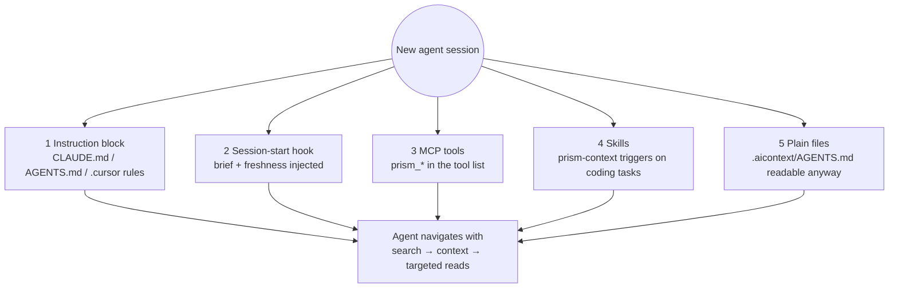

# Agent integrations

PRISM's core knows nothing about any particular agent. Integrations only install files and
configuration so the agent discovers PRISM at session start and knows how to use it.

- [What gets installed](#what-gets-installed)
- [How a session discovers PRISM](#how-a-session-discovers-prism)
- [Claude Code](#claude-code)
- [Cursor](#cursor)
- [Codex and other AGENTS.md readers](#codex-and-other-agentsmd-readers)
- [MCP server](#mcp-server)
- [Skills](#skills)
- [Hooks](#hooks)
- [Consent](#consent)
- [Headless and CI use](#headless-and-ci-use)

## What gets installed

`prism init --agent <name>` (or `auto`) installs:

| Agent | Files |
|---|---|
| **Claude Code** | `.claude/skills/prism-context/`, `prism-refresh/`, `prism-audit/`, `prism-decisions/` (one `SKILL.md` each); hooks in `.claude/settings.json`; a `prism` server in `.mcp.json`; a short managed block in `CLAUDE.md` |
| **Cursor** | `.cursor/rules/prism.mdc` (navigation rules plus the refresh and audit procedures, always applied); `.cursor/mcp.json` |
| **Codex / generic** | A managed block in the root `AGENTS.md` describing the CLI workflow |
| **Git hooks** (any agent, optional) | `post-commit`, `post-merge` and `post-checkout` hooks running `prism update --quiet` |

Every installer merges into existing files instead of replacing them, backs up what it modifies
to `.aicontext/cache/backups/`, marks what it owns as `prism-managed`, is idempotent, and is
fully reversed by `prism uninstall-integration`.

## How a session discovers PRISM

An agent only knows what is in its context, so PRISM places itself there through several
layers. If one is missing, another still works.



| Situation | What the agent sees |
|---|---|
| Enabled for you, PRISM installed | The brief injected automatically; skills and MCP tools guide navigation |
| Initialized by a teammate, not enabled for you | One line saying PRISM is available and how to enable it; nothing runs |
| `.aicontext/` committed, PRISM not installed | Hooks are silent; the instruction block still points to `.aicontext/AGENTS.md` |
| Never initialized | Nothing |
| Enabled but paused | Hooks do nothing; `prism status` shows `paused` |
| Enabled, index stale after `git pull` | The session-start hook catches up incrementally first |

## Claude Code

Hooks added to `.claude/settings.json`:

```json
{
  "hooks": {
    "SessionStart": [
      {
        "matcher": "startup|resume|clear|compact",
        "hooks": [{ "type": "command", "command": "prism hook session-start", "timeout": 10 }]
      }
    ],
    "PostToolUse": [
      {
        "matcher": "Edit|Write|MultiEdit",
        "hooks": [{ "type": "command", "command": "prism hook post-edit", "timeout": 5 }]
      }
    ]
  }
}
```

MCP entry added to `.mcp.json`:

```json
{ "mcpServers": { "prism": { "command": "prism", "args": ["mcp"] } } }
```

The managed `CLAUDE.md` block tells the agent to start from the brief, use `prism search` and
`prism context` before exploring files, run `prism impact` before changing public symbols, and
never run `prism init`, `scan`, `enable` or `install --global` unless you ask.

## Cursor

Cursor receives one always-applied rule, `.cursor/rules/prism.mdc`, containing the instruction
block and the bodies of the `prism-context`, `prism-refresh` and `prism-audit` skills, plus the
MCP server in `.cursor/mcp.json`. Cursor has no hooks, so the rule tells the agent to run
`prism update --files …` after editing; alternatively run `prism watch`.

## Codex and other AGENTS.md readers

Agents that read a root `AGENTS.md` get a managed block with the same workflow expressed as CLI
commands. Configure the MCP server manually if your agent supports MCP.

## MCP server

`prism mcp` runs a local stdio server started by the agent. There is no network listener. Each
tool is a thin wrapper over the same library function as the corresponding CLI command, returns
structured JSON, and reports problems as structured errors (`not_enabled`, `index_missing`,
`ambiguous_target` with candidates, `not_found` with suggestions) so the agent can recover.

| Tool | Input | Returns |
|---|---|---|
| `prism_status` | | Enable state, freshness, changed files, drift, stale sections, audit summary |
| `prism_brief` | | `AGENTS.md` plus the freshness line |
| `prism_search` | `query`, `limit?`, `semantic?` | Ranked hits (id, kind, file, lines, score, snippet) |
| `prism_locate` | `name` | Candidates with file and lines |
| `prism_context` | `target`, `budget?`, `depth?`, `with_source?` | A context pack |
| `prism_impact` | `target`, `depth?` | Dependents by distance and tests to run |
| `prism_module` | `name` | A module summary |
| `prism_refresh_prepare` | `sections?` | Refresh packet per stale section |
| `prism_refresh_commit` | `section`, `text` | Validation result; resets drift on success |
| `prism_audit_plan` | `scope?`, `since?`, `depth?` | The audit plan |
| `prism_audit_record` | `finding` | Assigned id, or duplicate / reopened, or validation errors |
| `prism_audit_update` | `id`, `status` | The updated finding |
| `prism_audit_report` | | Report path and new / fixed / persisting counts |
| `prism_decisions` | | Recorded architecture decisions |
| `prism_decision_record` | title, context, decision, … | The recorded decision |
| `prism_graph_view_url` | `focus?`, `depth?` | The local viewer URL, if you have `prism view` running |

Only `prism_refresh_commit`, `prism_audit_record`, `prism_audit_update`,
`prism_decision_record` and `prism_audit_report` write, and only inside `.aicontext/`. No tool
edits source code or runs shell commands.

If PRISM is not enabled for the current user, or is paused, the server exposes only
`prism_status`, which reports that state.

## Skills

Skills are the instruction files through which your agent does PRISM's thinking. They are
product code: versioned, snapshot-tested, and checked so they only mention commands, flags and
fields that exist.

| Skill | Triggers | Procedure |
|---|---|---|
| `prism-context` | Start of any coding task; "where is / what calls / what breaks if" | brief → search/locate → context → read the read list only → impact before editing public symbols → edit → run listed tests → update if there are no hooks |
| `prism-refresh` | Stale sections reported, or you ask to refresh the brief | refresh prepare → read the packet → rewrite each stale section within its budget → refresh commit → report what changed |
| `prism-audit` | "Audit", "find bugs", "what's broken", "check before I merge" | See [audit.md](audit.md) |
| `prism-decisions` | You make or ask to record a design decision, or the agent needs to know why code is built a certain way | decision list or search → decision show → decision add (only for decisions you made) → confirm the id |

Shared guardrails: never run `init`, `scan`, `enable` or `install --global` unasked; never load
whole JSON artifacts; fall back to a targeted grep (never a full scan) when static analysis
misses dynamic calls; never hand-edit `.aicontext/`.

## Hooks

Hooks must never break or slow an agent session:

- **session-start** (10 s host timeout): consent check, incremental catch-up of changes made
  outside the agent (bounded to a few hundred files), then prints the brief and a freshness line.
- **post-edit** (5 s host timeout): reads the hook JSON from stdin, and if the edited file is a
  source file in an enabled repository, runs `prism update --files <path>` time-boxed to 0.9 s.
- Both always exit 0, print nothing on error (errors go to `.aicontext/cache/hook.log`), and do
  nothing if PRISM is missing, not enabled for you, or paused.

## Consent

PRISM runs in a repository only after a user enables it there, and each user decides for
themselves:

- `prism init` enables PRISM for the user who ran it. Teammates run `prism enable`.
- The flag lives in `~/.config/prism/repos.toml` (or `$PRISM_CONFIG_HOME/repos.toml`), keyed by
  repository path and the repository id in `manifest.json`. It is never committed.
- Without the flag, `prism hook session-start` prints at most one line and does nothing else;
  `prism hook post-edit` exits silently; the MCP server exposes only `prism_status`.
- `prism pause` / `prism resume` turn automatic activity off and on without removing anything.

Agents must never run `prism init`, `prism scan`, `prism enable` or `prism install --global`
unless you explicitly ask in the current conversation. Every shipped skill and instruction block
says so.

## Headless and CI use

PRISM has no API client. To run PRISM-driven work in CI, run your agent in headless mode, for
example:

```bash
claude -p "run the prism-audit skill with depth quick and summarize the report"
```
