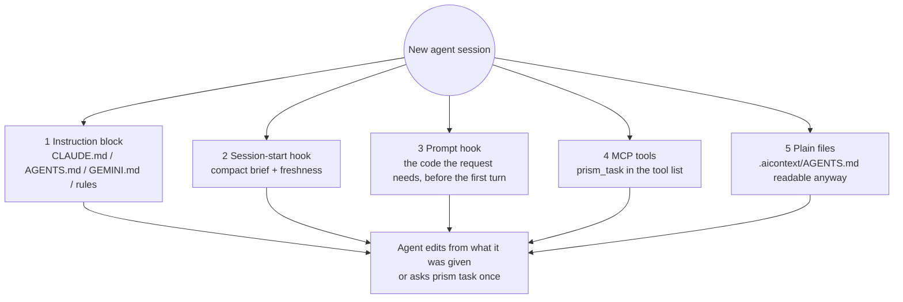

# Agent integrations

PRISM's core knows nothing about any particular agent. Integrations only install files and
configuration so the agent discovers PRISM at session start and knows how to use it. Each agent
gets what it supports: some have hooks (PRISM can put the answer in front of the model before it
asks), some only an instruction file and MCP.

- [What gets installed](#what-gets-installed)
- [How a session discovers PRISM](#how-a-session-discovers-prism)
- [Claude Code](#claude-code)
- [Codex](#codex)
- [Gemini CLI](#gemini-cli)
- [Cursor](#cursor)
- [Antigravity](#antigravity)
- [Any other agent](#any-other-agent)
- [MCP server](#mcp-server)
- [Skills](#skills)
- [Hooks](#hooks)
- [Consent](#consent)
- [Headless and CI use](#headless-and-ci-use)

## What gets installed

`prism init --agent <name>` (or `auto`, which detects `.claude/`, `.cursor/`, `.codex/`,
`.gemini/` and `.agent/`) installs:

| Agent | Instruction file | MCP | Hooks | Other |
|---|---|---|---|---|
| **Claude Code** | managed block in `CLAUDE.md` | `.mcp.json` | `.claude/settings.json`: SessionStart, UserPromptSubmit, PostToolUse | `.claude/skills/prism-*/SKILL.md` |
| **Codex** | managed block in `AGENTS.md` | `.codex/config.toml` | `.codex/hooks.json`: SessionStart, UserPromptSubmit, PostToolUse | |
| **Gemini CLI** | managed block in `GEMINI.md` | `.gemini/settings.json` | same file: SessionStart, BeforeAgent, AfterTool | |
| **Cursor** | always-on rule `.cursor/rules/prism.mdc` | `.cursor/mcp.json` | `.cursor/hooks.json`: sessionStart, afterFileEdit | on-request rules for audit, refresh, decisions |
| **Antigravity** (experimental) | `.agent/rules/prism.md` | printed for you to add (user-level file) | none documented | `.agents/skills/prism-context/` |
| **Generic** | managed block in `AGENTS.md` | | | |
| **Git hooks** (any agent, optional) | | | `post-commit`, `post-merge`, `post-checkout` run `prism update --quiet` | |

Every installer merges into existing files instead of replacing them, backs up what it modifies
to `.aicontext/cache/backups/`, marks what it owns as `prism-managed`, is idempotent, and is
fully reversed by `prism uninstall-integration`. A user's own hooks, MCP servers and TOML tables
are never touched; a `[mcp_servers.prism]` table you wrote yourself is left alone.

## How a session discovers PRISM

An agent only knows what is in its context, so PRISM places itself there through several
layers. If one is missing, another still works.



| Situation | What the agent sees |
|---|---|
| Enabled for you, PRISM installed | The compact brief; the code for each request added to the prompt (agents with a prompt hook) or one `prism task` call away |
| Initialized by a teammate, not enabled for you | One line saying PRISM is available and how to enable it; nothing runs |
| `.aicontext/` committed, PRISM not installed | Hooks are silent; the instruction block still points to `.aicontext/AGENTS.md` |
| Never initialized | Nothing |
| Enabled but paused | Hooks do nothing; `prism status` shows `paused` |
| Edits made without any hook | The next answer checks the working tree and updates the changed files first |

## Claude Code

Hooks added to `.claude/settings.json`:

```json
{
  "hooks": {
    "SessionStart": [
      { "matcher": "startup|resume|clear|compact",
        "hooks": [{ "type": "command", "command": "prism hook session-start", "timeout": 10 }] }
    ],
    "UserPromptSubmit": [
      { "hooks": [{ "type": "command", "command": "prism hook user-prompt", "timeout": 10 }] }
    ],
    "PostToolUse": [
      { "matcher": "Edit|Write|MultiEdit",
        "hooks": [{ "type": "command", "command": "prism hook post-edit", "timeout": 5 }] }
    ]
  }
}
```

Plain stdout from `SessionStart` and `UserPromptSubmit` hooks is added to the conversation.
MCP entry in `.mcp.json`: `{ "mcpServers": { "prism": { "command": "prism", "args": ["mcp"] } } }`.
The managed `CLAUDE.md` block (about 100 tokens) tells the agent to start with `prism task`, and
never to run `prism init`, `scan`, `enable` or `install --global` unless you ask.

## Codex

`.codex/config.toml` gets a managed block:

```toml
# prism-managed:start
[mcp_servers.prism]
command = "prism"
args = ["mcp"]
startup_timeout_sec = 20
tool_timeout_sec = 60
# prism-managed:end
```

and `.codex/hooks.json` the same three events as Claude Code, with `PostToolUse` matching
`apply_patch|Edit|Write` (PRISM reads the changed files from the patch). Codex loads project
`.codex/` settings only for a **trusted project** and asks you to review new hooks (`/hooks`);
`prism init` reminds you. Codex sets aside hook output beyond about 2,500 tokens, so the prompt
hook's default budget (1,200) stays well under it.

## Gemini CLI

`.gemini/settings.json` gets the MCP server and three hooks (timeouts in milliseconds):
`SessionStart` and `BeforeAgent` run with `--format json`, which prints
`{"hookSpecificOutput": {"additionalContext": ...}}`, and `AfterTool` (`write_file|replace`)
updates the index. Instructions go in a managed block in `GEMINI.md`, which Gemini CLI reads by
default.

## Cursor

An always-on rule, `.cursor/rules/prism.mdc`, holds only the short instruction block (it is sent
every turn). The audit, refresh and decision procedures are separate rules the agent asks for by
description, so they cost nothing in a session that never audits. `.cursor/hooks.json` adds
`sessionStart` (the brief, returned as `additional_context`) and `afterFileEdit` (index update).
Cursor's `beforeSubmitPrompt` can only block a prompt, not add to it, so there is no prompt hook:
the agent calls `prism_task` (or `prism task`) itself.

## Antigravity

Experimental. Antigravity reads workspace rules from `.agent/rules/` and skills from
`.agents/skills/`, so PRISM installs a short rule and the `prism-context` skill. Its MCP servers
are configured in a user-level file (`~/.gemini/antigravity/mcp_config.json`), which PRISM never
edits on its own; `prism init` prints the entry to add. No hooks are documented, so freshness
relies on the working-tree check every answer starts with.

## Any other agent

Agents that read a root `AGENTS.md` get the same managed block describing the workflow as CLI
commands. Configure the MCP server manually if your agent supports MCP.

## MCP server

`prism mcp` runs a local stdio server started by the agent. There is no network listener. Each
tool is a thin wrapper over the same library function as the corresponding CLI command, returns
structured JSON, and reports problems as structured errors (`not_enabled`, `index_missing`,
`ambiguous_target` with candidates, `not_found` with suggestions) so the agent can recover.

Most agents send every tool's schema to the model on every turn, so the default **lean** profile
exposes only what a coding task needs. `prism mcp --profile full` (or `PRISM_MCP_PROFILE=full`)
adds the rest.

| Tool | Profile | Input | Returns |
|---|---|---|---|
| `prism_status` | lean | | Enable state, freshness, changed files, drift, stale sections, audit summary |
| `prism_task` | lean | `query`, `budget?`, `repeat?` | The code, every exact string match, callers, tests and impact for a request in one call |
| `prism_context` | lean | `target`, `budget?`, `depth?`, `with_source?` | A context pack |
| `prism_impact` | lean | `target`, `depth?` | Dependents by distance and tests to run |
| `prism_brief` | full | `full?` | The compact brief (or all of `AGENTS.md`) plus the freshness line |
| `prism_search` | full | `query`, `limit?`, `semantic?` | Ranked hits (id, kind, file, lines, score, snippet) |
| `prism_locate` | full | `name` | Candidates with file and lines |
| `prism_module` | full | `name` | A module summary |
| `prism_refresh_prepare` | full | `sections?` | Refresh packet per stale section |
| `prism_refresh_commit` | full | `section`, `text` | Validation result; resets drift on success |
| `prism_audit_plan` | full | `scope?`, `since?`, `depth?` | The audit plan |
| `prism_audit_record` | full | `finding` | Assigned id, or duplicate / reopened, or validation errors |
| `prism_audit_update` | full | `id`, `status` | The updated finding |
| `prism_audit_report` | full | | Report path and new / fixed / persisting counts |
| `prism_decisions` | full | | Recorded architecture decisions |
| `prism_decision_record` | full | title, context, decision, … | The recorded decision |
| `prism_graph_view_url` | full | `focus?`, `depth?` | The local viewer URL, if you have `prism view` running |

`prism_task` remembers the code it returned during the server's life and answers a repeat with
one-line references; pass `repeat=true` after the agent's context was compacted. Only
`prism_refresh_commit`, `prism_audit_record`, `prism_audit_update`, `prism_decision_record` and
`prism_audit_report` write, and only inside `.aicontext/`. No tool edits source code or runs
shell commands. If PRISM is not enabled for the current user, or is paused, the server exposes
only `prism_status`, which reports that state.

## Skills

Skills are the instruction files through which your agent does PRISM's thinking. They are
product code: versioned, snapshot-tested, and checked so they only mention commands, flags and
fields that exist.

| Skill | Triggers | Procedure |
|---|---|---|
| `prism-context` | Start of any coding task; "where is / what calls / what breaks if" | `prism task` → edit from the answer → follow up with `context` / `impact` → run the listed tests |
| `prism-refresh` | You ask to refresh the brief, or sections you wrote are reported stale | refresh prepare → read the packet → rewrite each stale section within its budget → refresh commit |
| `prism-audit` | "Audit", "find bugs", "what's broken", "check before I merge" | See [audit.md](audit.md) |
| `prism-decisions` | You make or ask to record a design decision, or the agent needs to know why code is built a certain way | decision list or search → decision show → decision add (only for decisions you made) |

Shared guardrails: never run `init`, `scan`, `enable` or `install --global` unasked; never load
whole JSON artifacts; fall back to a targeted grep (never a full scan) when static analysis
misses dynamic calls; never hand-edit `.aicontext/`. `prism-context` is deliberately short: its
text is loaded whenever it triggers.

## Hooks

Hooks must never break or slow an agent session. They start without importing the full command
line (about 0.2 s), always speak UTF-8 (a Windows pipe defaults to a code page that would make
a non-Latin character silently drop the output), always exit 0, print nothing on error (errors go
to `.aicontext/cache/hook.log`), and do nothing if PRISM is missing, not enabled for you, or paused.

- **session-start**: consent check, a bounded catch-up for changes made outside the agent, then
  prints the compact brief and a freshness line.
- **user-prompt**: looks up the user's own words and adds the answer to the prompt. It says
  nothing for greetings, confirmations, slash commands and shell escapes, nor when the match is
  weak (so an unrelated request costs zero tokens), adds at most `prompt_budget` tokens (default
  2,000). It starts at 1,200 and expands only if that supplies complete edit evidence.
  It sends code only once per session: repeats are one-line references. If the query
  caches are cold (a fresh clone) it starts building them in the background and stays silent
  once. Switch it off with `prompt_context = false` in the config or `PRISM_PROMPT_CONTEXT=0`.
- **post-edit**: if the edited file is a source file in an enabled repository, starts
  `prism update` for it in a detached process and returns immediately. A question asked before it
  finishes waits for the same lock and then sees the edit.

## Finish-time check and read dedupe

- **Stop hook** (`prism hook stop`; Claude Code, Codex, Antigravity): for a request that changes a
  value everywhere it appears, the prompt hook notes that its answer was an exhaustive list. When
  the agent is about to finish, the hook re-runs the request in verify mode; if the old number or quantity
  is still in the code, it sends the agent back **once** with the remaining lines, otherwise it says
  nothing and costs nothing. It never loops (`stop_hook_active` is honoured) and protects the result
  rather than shortening the session. Verified against Codex 0.162 and documented for Claude Code.
- **Read dedupe** (`prism hook dedupe-read`; Claude Code `PreToolUse` on `Read`; install with
  `prism init --dedupe-reads`, off by default): refuses a re-read of an unchanged range the agent
  already has, with a reason saying so. It only ever **denies**; it never approves a call, so it cannot widen
  what the agent may do. Entries expire after 20 minutes (a compaction may have dropped the text), an edited
  file is always readable, and `PRISM_DEDUPE=0` switches it off. A matching `PostToolUse`
  hook records only text actually returned by a successful read; failed or denied reads never
  block a retry. `SessionStart` clears coverage on startup, resume, clear and compaction.
  Unknown response formats remain readable. Reinstall the integration to add these companion hooks.
- **Skills**: only `prism-context` is installed by default, because every skill's name and description sit
  in the agent's context on every call. `prism init --all-skills` adds audit, refresh and decisions.

## Settings that belong to the host

PRISM cannot change these, but they matter for cost:

- **Claude Code**: route exploration to a cheaper model (`CLAUDE_CODE_SUBAGENT_MODEL=haiku`, or a
  `model:` in a subagent file). Delegation overhead can outweigh the saving on small tasks.
- **Codex**: `model_reasoning_effort` and `model_verbosity` are cost levers; a compaction replaces the cached prefix
  and each retry re-sends the whole context; AGENTS.md stops being read at 32 KiB (`project_doc_max_bytes`).
  MCP tools are loaded on demand, so an agent only finds `prism_task` if it searches for it: the prompt hook is the
  reliable delivery there.
- **Gemini CLI**: prompt caching applies with API-key authentication, and short prompts under the model's minimum
  (4,096 tokens on newer Flash models) do not qualify.

## Consent

PRISM runs in a repository only after a user enables it there, and each user decides for
themselves:

- `prism init` enables PRISM for the user who ran it. Teammates run `prism enable`.
- The flag lives in `~/.config/prism/repos.toml` (or `$PRISM_CONFIG_HOME/repos.toml`), keyed by
  repository path and the repository id in `manifest.json`. It is never committed.
- Without the flag, `prism hook session-start` prints at most one line and does nothing else;
  `prism hook user-prompt` and `post-edit` exit silently; the MCP server exposes only
  `prism_status`; queries read the committed index but never update it.
- `prism pause` / `prism resume` turn automatic activity off and on without removing anything.

Agents must never run `prism init`, `prism scan`, `prism enable` or `prism install --global`
unless you explicitly ask in the current conversation. Every shipped skill and instruction block
says so.

## Headless and CI use

PRISM has no API client. To run PRISM-driven work in CI, run your agent in headless mode, for
example:

```bash
claude -p "run the prism-audit skill with depth quick and summarize the report"
```
