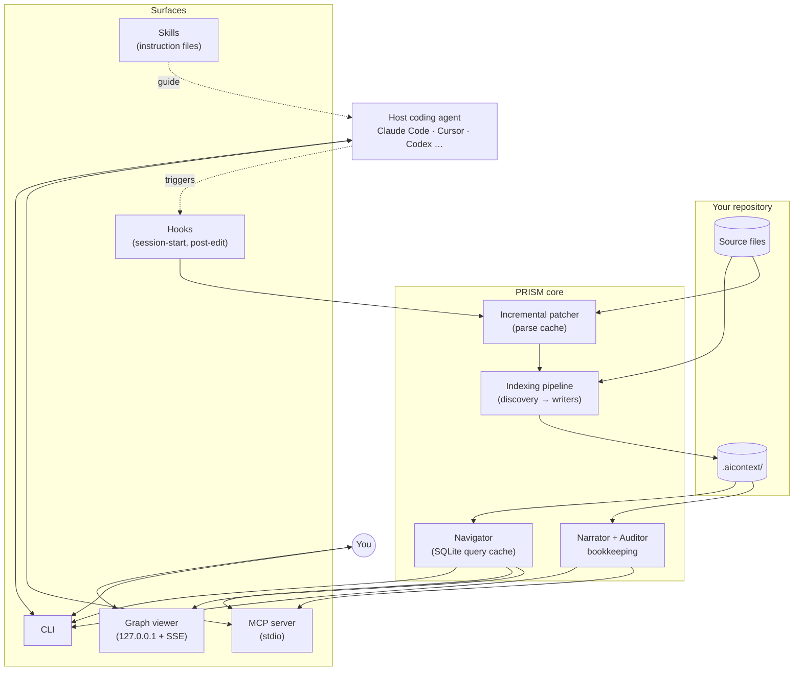
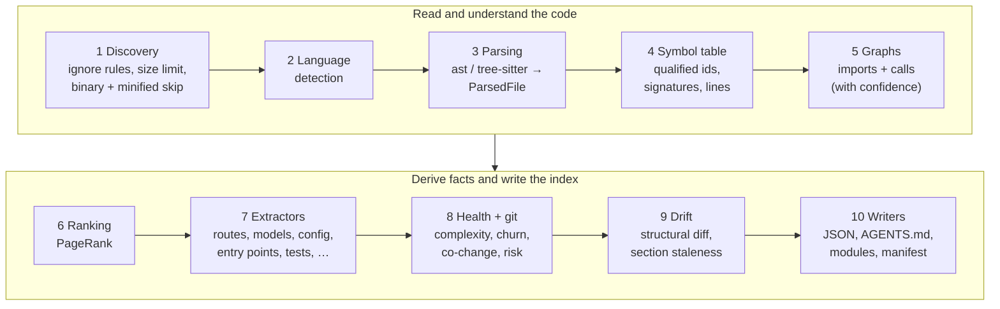
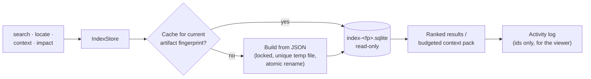
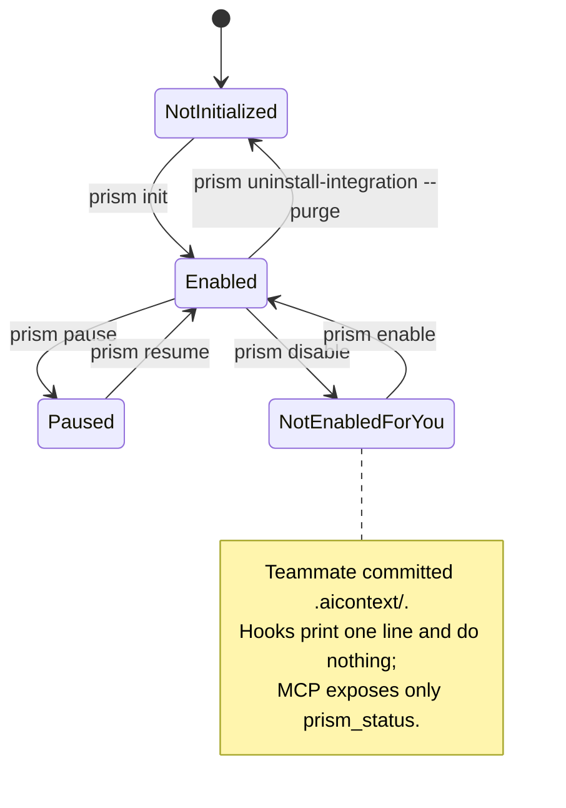
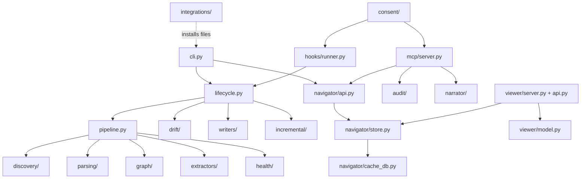

# Architecture

This guide explains how PRISM is put together: the indexing pipeline, incremental updates, the
query path, the surfaces agents and people use, and the rules that keep it all deterministic and
local. The product specification is [CLAUDE.md](../CLAUDE.md); this document describes the code
as it is.

- [The core principle](#the-core-principle)
- [System overview](#system-overview)
- [The indexing pipeline](#the-indexing-pipeline)
- [Incremental updates](#incremental-updates)
- [The query path](#the-query-path)
- [Surfaces](#surfaces)
- [Freshness and drift](#freshness-and-drift)
- [Consent](#consent)
- [Package layout](#package-layout)
- [Determinism](#determinism)
- [Performance targets](#performance-targets)

## The core principle

**PRISM computes, the agent thinks.** PRISM itself never calls a language model and never needs
an API key. It does deterministic static analysis and bookkeeping. Work that needs reasoning,
such as writing the `AGENTS.md` narrative or judging whether code is buggy, is delegated to the
coding agent the user already runs, through skills (instruction files) and tools (CLI and MCP).

## System overview



## The indexing pipeline

A scan runs ten sequential stages. Each is independently testable, communicates through typed
dataclasses (never loose dicts or global state), and never imports from a later stage.
Orchestration lives in `prism/pipeline.py` and `prism/lifecycle.py`.



| # | Stage | Code | Notes |
|---|---|---|---|
| 1 | Discovery | `discovery/scanner.py` | `.gitignore` (scoped per directory, with `!` re-includes), `.prismignore`, config `ignore`, built-in ignores (virtualenvs, `node_modules`, build output), size limit, binary files, minified bundles. Output sorted by path. |
| 2 | Language detection | `discovery/language.py` | By extension, falling back to the shebang. |
| 3 | Parsing | `parsing/` | `python_ast.py` for Python (stdlib `ast`); `treesitter.py` for JavaScript, TypeScript, Go and Java when the `treesitter` extra is installed. All parsers produce the same `ParsedFile`. |
| 4 | Symbol table | `graph/symbol_table.py` | Fully qualified ids such as `pkg.module.Class.method`, signatures, line ranges, first doc line, visibility. |
| 5 | Graphs | `graph/import_graph.py`, `graph/call_graph.py` | Module import graph and a best-effort static call graph; each call edge carries `high`, `medium` or `low` resolution confidence. |
| 6 | Ranking | `graph/ranking.py` | In-house PageRank ([ADR 0001](adr/0001-phase-1-index-decisions.md)); scores order everything and drive budgets. |
| 7 | Extractors | `extractors/` | Pluggable through a registry: routes, ORM models, config keys and env vars, entry points, tests map, dead-code candidates, blast radius, project facts and toolchain commands. |
| 8 | Health + git | `health/` | Cyclomatic complexity, churn, ownership and co-change from `git log`, coverage when a report exists, and a combined risk score. Works without git. |
| 9 | Drift | `drift/` | Compares structural facts with the previous run and scores how stale each `AGENTS.md` section is. |
| 10 | Writers | `writers/` | The only code that writes `.aicontext/`. Byte-stable JSON, the brief, module summaries, and the manifest with a SHA-256 per file and artifact. |

## Incremental updates

`prism update` (and the post-edit hook) re-parses only what changed and reuses everything else.

```mermaid
sequenceDiagram
    autonumber
    participant Agent
    participant Hook as prism hook post-edit
    participant Life as lifecycle.update
    participant Disc as Discovery
    participant Cache as Parse cache
    participant Pipe as Pipeline
    participant W as Writers

    Agent->>Hook: Edit tool finished (hook JSON on stdin)
    Hook->>Hook: consent check (enabled and not paused?)
    Hook-->>Agent: exit 0 at once (about 0.2 s); the update continues in a detached process
    Hook->>Life: update(files=[edited files]) under the update lock
    Life->>Disc: walk the repo, reuse hashes of unchanged files
    Disc-->>Life: added / changed / deleted
    Life->>Cache: cached parses for unchanged files
    Life->>Pipe: parse changed files, rebuild graphs from parses
    Pipe->>Pipe: lazy PageRank (reuse scores if few edges changed)
    Pipe->>W: artifacts + structural diff
    W->>W: write only files whose content changed
    W-->>Life: new manifest (hashes, drift, timestamps)
    Note over Agent,W: a query that arrives first checks the working tree itself and waits on the lock
```

Key points:

- **Hash reuse.** `manifest.json` stores SHA-256, size and mtime per source file. Unchanged files
  skip hashing; files named with `--files` are always re-hashed.
- **Parse cache.** Parsed files are stored in `.aicontext/cache/`, so only changed files go
  through a parser again.
- **Lazy ranking.** Full PageRank runs only when more than max(10, 2% of edges) edges changed.
  Otherwise previous scores are kept and the manifest marks ranking as approximate until the
  next full scan.
- **Minimal writes.** Artifacts whose content hash is unchanged are not rewritten, so mtimes stay
  stable and watchers see only real changes.
- **Equivalence.** `scan` from scratch must equal `scan` followed by any number of `update`s.
  This is the most important correctness test in the suite.
- **Early exit.** If no file and no git history changed, `update` returns without writing.

The hook gives the update 0.9 s. Files are written atomically and the manifest last, so an
update cut off by the time box never leaves a corrupt index; the next update catches up.

## The query path

Navigator queries never read the large JSON artifacts directly. They go through a read-only
SQLite cache built from the artifacts and keyed by their fingerprint.



- **Search** is BM25 over symbol names, qualified ids, docstrings, paths, routes and decisions.
  Terms are split on `snake_case` and `camelCase` and lightly stemmed; exact names get a boost,
  PageRank breaks ties, and tests and migrations rank below application code unless the query
  asks for them. `--semantic` blends in a local embedding model.
- **Context packs** always include the target's location and signature, then greedily fill the
  token budget (default 2,000) with callers, callees, tests, co-changed files and config or model
  touch-points, each tagged with why it is there.
- **Impact** walks reverse dependencies by distance and lists the tests to run.
- **Resolution** accepts symbol ids, files, `file:line`, modules and routes such as `GET /orders`.
  Ambiguity returns ranked candidates, never a silent guess.

## Surfaces

| Surface | Code | Purpose |
|---|---|---|
| CLI | `prism/cli.py` | Humans and agents with a shell. Markdown by default, `--json` for tools. |
| MCP server | `prism/mcp/server.py` | Native tools in the agent's tool list over stdio; each tool wraps the same library function as the CLI. |
| Hooks | `prism/hooks/runner.py` | Session-start catch-up and brief injection; post-edit update. Always exit 0, never print errors into the agent's context. |
| Skills | `prism/templates/skills/` | Instruction files that teach the agent the navigation, refresh, audit and decision workflows. |
| Graph viewer | `prism/viewer/`, `viewer/` | Stdlib HTTP + Server-Sent Events backend and a Sigma.js frontend. See [viewer.md](viewer.md). |
| Exports | `prism/writers/graph_export.py`, `obsidian.py` | HTML, Obsidian vault, Mermaid, DOT, GraphML, JSON. |

The CLI, MCP server and viewer API never contain logic of their own; they call the library.

## Freshness and drift

Each update computes a structural diff and adds weighted points to the `AGENTS.md` sections and
module summaries it affects:

| Change | Weight |
|---|---:|
| New or deleted module or package | 5 |
| New, removed or renamed public symbol | 2 |
| Public signature change | 2 |
| New or removed route, model or config key | 3 |
| Import edge added or removed between modules | 1 each, capped at 5 |
| Symbol enters or leaves the global top 20 by PageRank | 3 |
| New declared dependency | 3 |
| Private, body-only, formatting or comment edits | 0 |

When a section reaches the threshold (default 8), it is marked stale. If someone has written
that section (placeholders cannot go stale), `prism brief` and `prism status` then tell the
agent to run the `prism-refresh` skill, which rewrites only the stale sections through
`refresh prepare` and `refresh commit`.

## Answering from the working tree

Hooks keep the index fresh for agents that have them, and many do not. So freshness does not
depend on any hook: every navigator query (CLI and MCP) first compares the working tree with the
manifest (a stat walk; files whose size and mtime match are not re-read) and, for a user PRISM
is enabled for, updates just the files that changed before answering. An update writes the index
under a cross-process lock (`.aicontext/cache/update.lock`), so a hook, a query and a manual
update take turns. More than 300 changed files is left for an explicit `prism update`.

## How a request becomes an answer

`prism task` is one retrieval call built from three kinds of evidence:

1. **Literals.** Quoted strings, code names, numbers with units and multi-word phrases in the
   request are looked up in the source postings (a term to files index) and then verified by
   exact match on the candidate files only. The result is every occurrence, not a ranking.
2. **Lines.** Candidate files (by BM25 over bodies and paths) are scanned line by line for the
   request's rarer words, with related words (a small code-domain synonym table) at half weight.
   Imports, module headers and test/doc/migration files are down-weighted.
3. **The graph.** Matching lines become blocks (a small symbol whole, or a window); blocks that
   call each other reinforce one another; the best symbols get their callers (with the calling
   line), tests that mention them and an impact count.

Confidence comes from exact evidence, the margin between the best block and the next, and how
much of the request's weight the best block covers.

Explanation/flow requests can expand a bounded slice of the native call graph using
Graphify-derived diverse seed selection and a hub guard. An optional `graphify_graph` setting
lets the budgeted pipeline use an existing Graphify export as advisory location hints.
PRISM verifies source; imported relationships do not become verified call or impact edges.
See [Graphify integration](graphify-integration.md) for limits and manual checks.

## Consent

PRISM only runs where a user has enabled it, and each user decides for themselves, even in a
shared repository with committed PRISM files.



The enable flag lives in `~/.config/prism/repos.toml` (or under `PRISM_CONFIG_HOME`), keyed by
repository path and repository id; it is never committed. See [agents.md](agents.md#consent).

## Package layout



Dependencies point one way: surfaces depend on the library, the library depends on the core
dataclasses in `prism/core/`, and pipeline stages only depend on earlier stages.

## Determinism

The same source always produces the same `.aicontext/` bytes, so the index can be committed and
reviewed like code.

- JSON is written with sorted keys and stable list ordering.
- PageRank uses a fixed summation order and rounds scores to six decimals.
- Timestamps appear only in `manifest.json`.
- Golden-file tests compare two runs byte for byte on fixture repositories.

## Performance targets

| Operation | Target | Measured (Windows, Python 3.14) |
|---|---|---|
| Query (`locate`, `context`, MCP) | < 200 ms p95 on 100k lines | 1–3 ms p95 on a 50k-line repository |
| One-file update | ≤ 0.5 s on 100k lines | ≈ 0.4 s in-process on 50k lines; ≈ 1 s including process start through the hook |
| Brief | ≤ 600 tokens | 409–472 tokens on the repositories tested |
| Default context pack | ≤ 2,000 tokens | enforced by the budget tests |
| Viewer first paint | < 2 s on 100k lines | ≈ 0.2 s graph load on a 90k-line synthetic repository |

See [benchmarks.md](benchmarks.md) for methodology.
