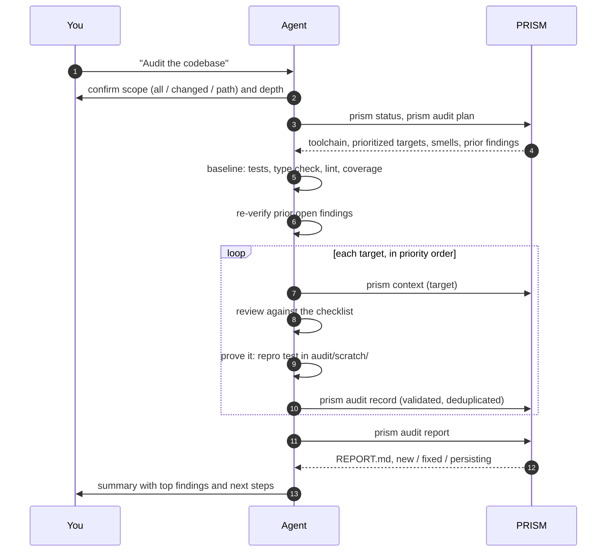
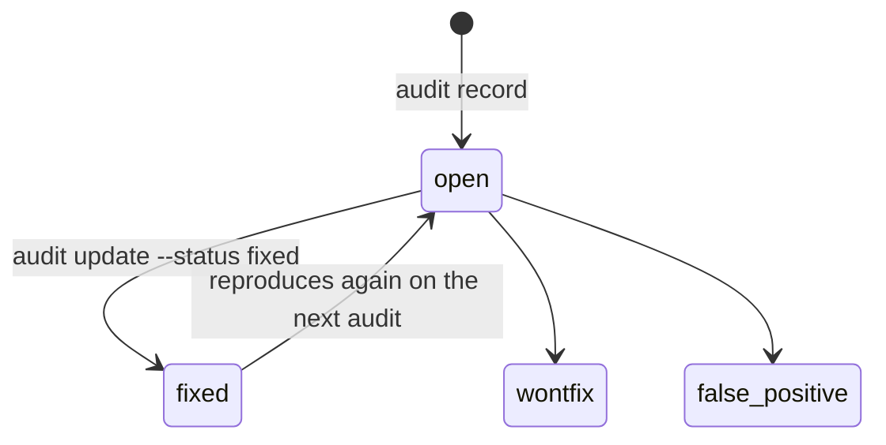

# Auditing a codebase

PRISM turns your own coding agent into an evidence-based codebase auditor. PRISM contributes what
it is good at: prioritizing targets from the index, detecting your test and lint commands,
validating findings, and rendering reports with history. Your agent contributes what it is good
at: reading code, reasoning about bugs, and running and writing tests. No API and no external
service are involved.

- [Running an audit](#running-an-audit)
- [The procedure](#the-procedure)
- [The audit plan](#the-audit-plan)
- [Findings](#findings)
- [Reports and history](#reports-and-history)
- [Safety](#safety)

## Running an audit

Ask your agent, for example:

- *"Audit the codebase."*
- *"Find bugs in the checkout module."*
- *"Check everything that changed since main before I merge."*

The `prism-audit` skill takes over. It confirms the scope and depth with you, then works through
the procedure below. In CI, run the agent headlessly:

```bash
claude -p "run the prism-audit skill with scope changed since origin/main, depth quick"
```

## The procedure



| Step | What happens |
|---|---|
| 0 Scope and safety | Agree the scope and depth; apply the safety rules to every command |
| 1 Preflight | `prism status`, then `prism audit plan` |
| 2 Baseline | Run the detected tests, type checker, linter and coverage |
| 3 Re-verify | Check whether earlier open findings still reproduce |
| 4 Targeted review | For each target: its context pack, then a checklist covering correctness, error handling, security, concurrency, resources, performance and API contracts |
| 5 Prove it | Reproduce the problem with a failing test or script in `.aicontext/audit/scratch/` |
| 6 Record | `prism audit record` for each finding |
| 7 Report | `prism audit report`, then a short summary to you |

## The audit plan

```bash
prism audit plan --scope all --depth standard
prism audit plan --scope changed --since main --depth quick
prism audit plan --scope src/payments
```

The plan (`.aicontext/audit/audit_plan.json`) contains:

- **Toolchain:** the project's own test, type-check, lint and coverage commands, detected per
  application in monorepos (for example `cd backend && python manage.py test`). PRISM detects
  them; it never runs them.
- **Targets**, scored by risk (complexity × churn × missing coverage), centrality (PageRank),
  blast radius, recency of change, static smells and open prior findings. Depth caps the list:
  *quick* about 10, *standard* about 30, *deep* about 100.
- **Static smells** as leads, not findings: bare or broad `except`, swallowed exceptions, mutable
  default arguments, `eval` / `exec` / `pickle.loads` / `subprocess(shell=True)`, SQL built by
  string formatting, hard-coded secret patterns, `TODO` / `FIXME` / `HACK`, very long functions,
  unreachable code, unused imports and symbols.
- Dead-code candidates, untested high-importance symbols, and prior findings to re-verify.

## Findings

Record a finding from a file or stdin:

```bash
prism audit record --json finding.json
cat finding.json | prism audit record --json -
```

```json
{
  "title": "Discount applied twice when coupon and sale overlap",
  "severity": "high",
  "category": "correctness",
  "confidence": "confirmed",
  "file": "src/pricing/discounts.py",
  "lines": [61, 74],
  "symbol": "pricing.discounts.apply_discount",
  "description": "The coupon is applied to the original price and both reductions are summed.",
  "evidence": {
    "type": "failing_test",
    "command": "pytest .aicontext/audit/scratch/test_f012.py -q",
    "output_excerpt": "AssertionError: 72.0 != 81.0"
  },
  "suggested_fix": "Apply the coupon to the post-sale price, or take the better of the two; confirm the rule with the owner."
}
```

| Field | Values |
|---|---|
| `severity` | `critical`, `high`, `medium`, `low`, `info` |
| `category` | `correctness`, `security`, `error_handling`, `concurrency`, `resource`, `performance`, `api_contract`, `test_gap`, `dead_code`, `maintainability`, `config` |
| `confidence` | `confirmed` (reproduced), `likely` (strong static reasoning), `suspected` (needs human judgment) |
| `evidence.type` | `failing_test`, `repro_script`, `tool_output`, `code_reasoning` |
| `reason` | Required when a `critical` or `high` finding is not `confirmed` |

Severity rubric used by the skill:

| Severity | Meaning |
|---|---|
| critical | Exploitable security hole, data loss or corruption, or a core flow completely broken in normal use |
| high | Wrong results or crashes in realistic scenarios; limited auth gaps; failing tests on the main branch |
| medium | Edge-case bugs, missing error handling that degrades behaviour, significant performance problems, important untested paths |
| low | Minor bugs with easy workarounds, dead code, small robustness gaps |
| info | Style and maintainability observations |

PRISM validates every finding against `prism/schemas/finding_input.schema.json`, assigns a stable
id (`F-001`, `F-002`, …), and deduplicates by file, symbol, category and a fingerprint, so
recording the same problem twice updates the existing finding instead of creating a new one.

Lifecycle:

```bash
prism audit update F-012 --status fixed
prism audit update F-013 --status false_positive --note "guarded by the caller"
```



Open findings appear in context packs and in `prism status`, and raise the risk score in
`health.json`, so your agent sees them the next time it touches that code.

## Reports and history

`prism audit report` renders `.aicontext/audit/REPORT.md`: a summary, a severity table, details
for every finding, and a diff against the previous audit (new, fixed, persisting). Each report is
archived in `audit/history/` for the next comparison.

## Safety

The audit is read-mostly:

- No fixes, commits or pushes unless you explicitly ask.
- No destructive or production-touching commands; the agent asks before running tests that need
  the network, a database or Docker.
- Repro files are written only to `.aicontext/audit/scratch/` (gitignored).
- Secrets are never printed; evidence excerpts are capped at 2,000 characters.
- `critical` and `high` findings need confirmed evidence or a stated reason.
