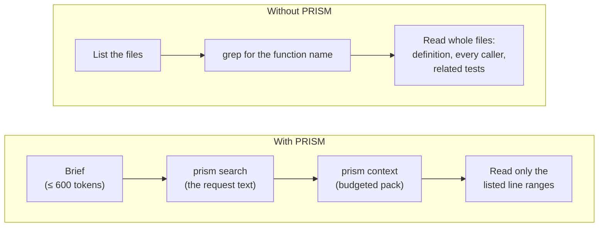

# Benchmarks

PRISM exists to make agents read less. This page explains how that is measured, what the
results are, and where they fall short. Both harnesses copy the repository into a temporary
directory with an isolated consent registry, so the source repository is never initialized,
scanned or modified.

- [Token savings](#token-savings)
- [Latency](#latency)
- [Reproducing the numbers](#reproducing-the-numbers)
- [Caveats](#caveats)

## Token savings

`python -m tests.benchmarks.tokens` replays realistic bug-fix requests, each paired with the
symbol a correct fix must touch, and counts the tokens an agent reads to orient itself under two
strategies. Tokens are estimated as characters ÷ 4, the same approximation PRISM uses for its
budgets.



The *without* strategy is generous to the baseline: it assumes the agent already knows the
function's name. A **best-case** baseline, where the agent magically reads only the defining file,
is also reported so savings are never overstated.

The session view adds project orientation (file list, README and dependency manifests without
PRISM; the brief with it) and the pre-edit `prism impact` check.

### Results

| Repository | Size | Tasks | Without | With PRISM | Saved | vs. best case |
|---|---|---:|---:|---:|---:|---:|
| Django + React/TypeScript web app | 305 files · 50k lines | 12 | 356,657 | 28,202 | **92%** | 75% |
| PRISM itself | 140 files · 20k lines | 10 | 105,846 | 28,981 | **73%** | 15% |
| `seeded` fixture | 12 files · 119 lines | 5 | 1,115 | 3,136 | −181% | −223% |

Where the tokens go on the web app, averaged per task (the session additionally pays project
orientation once: 5,978 tokens without PRISM, 472 with the brief):

| Step | Without PRISM | With PRISM |
|---|---:|---:|
| File list | 3,334 | — |
| grep for the name | 543 | — |
| Defining file (whole) | 4,448 | — |
| Caller files (whole) | 18,307 | — |
| Related test files (whole) | 2,592 | — |
| Brief | — | 472 |
| Search results | — | 393 |
| Context pack | — | 500 |
| Targeted reads (listed ranges only) | — | 760 |
| **Per task** | **29,224** | **2,125** |
| Pre-edit `impact` check | — | 186 |

Quality checks from the same runs:

| Check | Web app | PRISM itself |
|---|---|---|
| Context pack lists every caller file | 12 of 12 tasks | 9 of 10 tasks |
| Right file in the top 3 search results | 9 / 12 | 10 / 10 |
| Exact function in the top 3 search results | 6 / 12 | 6 / 10 |
| Index finds the function at its new lines after an edit | 12 / 12 | 10 / 10 |
| Tests targeted by `impact` | 0.4 of 7 test files (tests mapped for 3 of 12 targets) | 6.7 of 27 test files |

### Reading the results

- On real projects PRISM cuts orientation tokens by roughly three quarters or more. Savings grow
  with the number of files that call the code being changed: a hook used by 22 components saved
  96%.
- On tiny repositories PRISM costs more, because its fixed overhead (brief, search and pack,
  about 1,300 tokens) exceeds reading the whole codebase.
- Search on plain-English bug reports usually lands in the right file but finds the exact
  function in the top 3 only about half the time; the agent then follows the pack from that file.
- `impact` can only target tests that exist; a project with few tests gets few targeted tests.

## Latency

`python -m tests.benchmarks.run` generates a synthetic repository and measures scan, update and
query times. Pass `--enforce` on a dedicated runner to fail when targets are missed.

| Operation | Target | Measured |
|---|---|---|
| Query p95 (`search`, `context`, `impact`) | < 200 ms on 100k lines | 1–3 ms on the 50k-line web app |
| One-file update | ≤ 0.5 s on 100k lines | ≈ 0.4 s in-process on the web app; ≈ 1.0 s through the post-edit hook including process start |
| Full scan | none | 2.8 s for the 50k-line web app (first run) |
| Viewer graph load | < 2 s first paint | ≈ 0.2 s for 4,000 symbols on a 90k-line synthetic repository |

Measured on Windows with Python 3.14. Numbers vary by machine; treat them as orders of magnitude.

## Reproducing the numbers

```bash
# Token savings on PRISM itself and the seeded fixture
python -m tests.benchmarks.tokens

# Any repository, with your own tasks
python -m tests.benchmarks.tokens --repo ../my-app --tasks tasks.json --json

# Latency on a generated repository
python -m tests.benchmarks.run --packages 20
```

`tasks.json` is a list of requests and the symbol id each one targets:

```json
[
  {"request": "login form shows [object Object] instead of the server error",
   "target": "frontend.src.api.auth.parseApiError"},
  {"request": "KPI percentage change compares against the wrong period",
   "target": "backend.core.analytics.build_kpis"}
]
```

Find symbol ids with `prism search` or `prism locate` on a scratch copy.

## Caveats

- These are modelled agent strategies, not recordings of a real agent. A real agent may read
  more or less than either strategy; running an agent headlessly with and without PRISM is the
  next level of evidence.
- Task targets are chosen by a person. Check them: in one run, PRISM's top result for "verification
  codes rejected as expired" was a different class that turned out to be the correct target.
- Token counts use characters ÷ 4, not a specific model's tokenizer.
