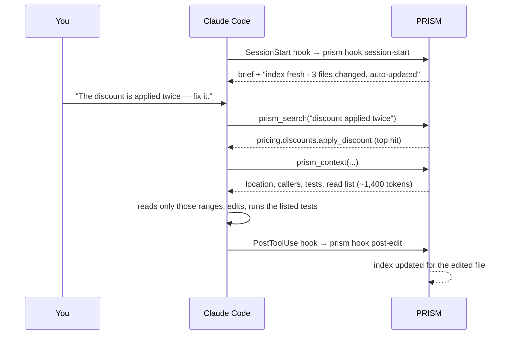

# Getting started

This guide takes you from installation to a working agent session with PRISM in about five
minutes.

- [1. Install](#1-install)
- [2. Enable PRISM in a repository](#2-enable-prism-in-a-repository)
- [3. Look around](#3-look-around)
- [4. Work with your agent](#4-work-with-your-agent)
- [5. Keep it healthy](#5-keep-it-healthy)
- [Sharing with a team](#sharing-with-a-team)
- [Removing PRISM](#removing-prism)

## 1. Install

PRISM needs Python 3.10 or newer. Git is optional but recommended: it adds churn, ownership and
co-change information.

```bash
pip install "git+https://github.com/Aashutosh-Mahajan/prism"   # PyPI release pending
prism --version
```

Optional extras:

| Extra | Adds |
|---|---|
| `prism-ctx[treesitter]` | Parsing for JavaScript, TypeScript, Go and Java (Python is always supported) |
| `prism-ctx[semantic]` | Local embeddings for `prism search --semantic` (the model must already be on disk; PRISM never downloads) |

Installing PRISM does nothing to any repository. It only runs where you enable it.

## 2. Enable PRISM in a repository

```bash
cd your-repo
prism init
```

`prism init` is interactive. It detects your agent, asks about the optional parts, then shows
every file it will create or modify and asks once more before touching anything. With hooks and
the MCP server declined, a Claude Code repository looks like this:

```text
Install agent hooks (session brief + index update after edits)? [Y/n]: n
Register the PRISM MCP server for your agent? [Y/n]: n
PRISM will make these changes in /home/you/your-repo:
  create   .aicontext/manifest.json  (new PRISM index directory)
  modify   .gitignore  (add .aicontext/cache/, .aicontext/audit/scratch/)
  register ~/.config/prism/repos.toml  (enable PRISM for you in this repo (local only))
  create   .claude/skills/prism-context/SKILL.md  (prism-context skill)
  create   .claude/skills/prism-refresh/SKILL.md  (prism-refresh skill)
  create   .claude/skills/prism-audit/SKILL.md  (prism-audit skill)
  create   .claude/skills/prism-decisions/SKILL.md  (prism-decisions skill)
  create   CLAUDE.md  (short PRISM instruction block)
Proceed? [Y/n]:
```

Accepting hooks adds entries to `.claude/settings.json`; accepting the MCP server adds a `prism`
entry to `.mcp.json`. At the end, `init` offers to run the first scan.

Useful options:

| Option | Effect |
|---|---|
| `--agent claude-code\|cursor\|codex\|generic\|none` | Choose the integration instead of auto-detecting |
| `--no-hooks` / `--no-mcp` / `--no-git-hooks` | Skip parts of the setup |
| `--yes` | Accept the defaults (for scripts) |
| `--scan` / `--no-scan` | Decide about the first scan up front |

The first scan of a 50,000-line repository takes a few seconds.

## 3. Look around

```bash
prism status                      # enabled? fresh? any stale brief sections?
prism brief                       # the ≤ 600-token project brief your agent receives
prism search "discount coupon"    # ranked hits with file:line
prism context shop.pricing.discounts.apply_discount
prism impact shop.pricing.discounts.apply_discount
prism view                        # the interactive graph in your browser
```

On the `small` fixture repository in `tests/fixtures/repos/`, search and a context pack look like
this (Markdown is the default; add `--json` for tools):

```text
$ prism search "discount coupon" --limit 4
# search "discount coupon"
- function `shop.pricing.discounts.apply_discount` src/shop/pricing/discounts.py:8-14 — Apply the best eligible discount to an amount.
- method `shop.checkout.cart.Cart.total` src/shop/checkout/cart.py:29-31 — Subtotal with the best discount applied.
- module `shop.pricing.discounts` src/shop/pricing/discounts.py — Applying discounts to carts.
- class `shop.pricing.rules.Rule` src/shop/pricing/rules.py:8-16 — A percentage discount with a minimum spend.

$ prism context shop.pricing.discounts.apply_discount
# Context: `shop.pricing.discounts.apply_discount`
function `apply_discount(amount: Money, rules: list['rules_mod.Rule'], coupon: float | None = None) -> Money` — src/shop/pricing/discounts.py:8-14
Apply the best eligible discount to an amount.
Risk 0.14

## Read list (252/2000 tokens)
1. src/shop/pricing/discounts.py:8-14 — target (~89 tok)
2. src/shop/checkout/cart.py:29-31 — caller `shop.checkout.cart.Cart.total` (~45 tok)
3. src/shop/pricing/rules.py:19-21 — callee `shop.pricing.rules.eligible_rules` (~41 tok)
4. tests/test_discounts.py:6-8 — test `tests.test_discounts.test_best_rule_wins` (~38 tok)
5. src/shop/money.py:15-17 — callee `shop.money.Money.scale` (~39 tok)

## Callers
- `shop.checkout.cart.Cart.total` src/shop/checkout/cart.py:31
…
## Blast radius: 8 files
…
```

The agent reads the five ranges in the read list (about 250 tokens) instead of the files around
them.

## 4. Work with your agent

With the Claude Code integration installed, you don't need to do anything differently:



For agents without hooks, the instruction block PRISM adds tells the agent to run
`prism update --files <changed files>` after editing, or you can run `prism watch` in a terminal.

Things to ask your agent:

- *"Refresh the PRISM brief."* runs the `prism-refresh` skill and writes the narrative sections
  of `AGENTS.md` (purpose, architecture, conventions). Do this once after the first scan.
- *"Audit the codebase"* or *"check before I merge"* runs the `prism-audit` skill. See
  [audit.md](audit.md).
- *"Record the decision to …"* runs the `prism-decisions` skill.

## 5. Keep it healthy

| Situation | What to do |
|---|---|
| You pulled or switched branches | Nothing with hooks (session start catches up), otherwise `prism update` |
| `prism status` reports stale sections | Ask the agent to refresh the brief |
| You upgraded PRISM and the schema changed | `prism migrate` |
| Something looks wrong | `prism doctor` (see [troubleshooting.md](troubleshooting.md)) |
| You want a break | `prism pause`, later `prism resume` |

## Sharing with a team

`.aicontext/` is designed to be committed, so every teammate and every AI session benefits from
one scan (`cache/` and `audit/scratch/` stay ignored). Committed files never switch PRISM on for
anyone else: each teammate who wants it runs `prism enable` once. Until then their hooks print a
single line saying PRISM is available and do nothing else.

## Removing PRISM

```bash
prism uninstall-integration          # remove skills, hooks, MCP entry and managed blocks (restores backups)
prism uninstall-integration --purge  # also delete .aicontext/ and your consent flag
pip uninstall prism-ctx
```
