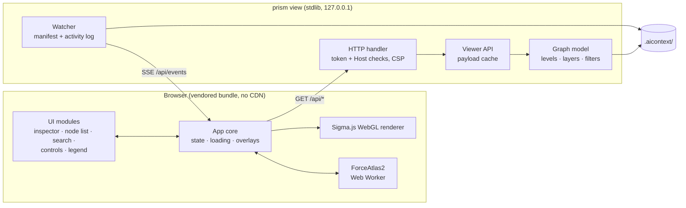

# Graph viewer

`prism view` opens an interactive, Obsidian-style graph of your codebase in the browser: a
zoomable map from packages down to individual functions, built from the same index your agent
uses. It runs entirely on your machine and works with the network unplugged.

- [Opening it](#opening-it)
- [The screen](#the-screen)
- [Levels and layers](#levels-and-layers)
- [Inspecting a node](#inspecting-a-node)
- [Finding things](#finding-things)
- [Overlays and analysis](#overlays-and-analysis)
- [Layout](#layout)
- [Live updates](#live-updates)
- [Keyboard and accessibility](#keyboard-and-accessibility)
- [Exports](#exports)
- [How it works](#how-it-works)
- [Security](#security)

## Opening it

```bash
prism view                                   # opens your browser on a random free port
prism view --focus shop.pricing.discounts --depth 2   # start on a local graph
prism view --port 8765 --no-open             # fixed port, print the URL instead
```

The URL contains a one-time token. Keep the terminal open; closing it stops the viewer. If the
page says it can't reach the server, restart `prism view` and open the new link it prints.

## The screen

```text
┌─ toolbar: PRISM · project · Packages | Files | Symbols · Show: Imports ▾ · Search (/) · ☰ ◐ ? ─┐
├──────────────┬──────────────────────────────────────────────────┬────────────────────────────┤
│ Nodes │ Explore│ Scope: Files · Imports · 304 nodes · 468 links    │ Inspector                  │
│ filter, sort │                                                  │ kind · name · location     │
│ ▸ core/models│                 the graph canvas                 │ stats: importance, links,  │
│ ▸ api/client │                                                  │ risk, blast radius         │
│ …            │  legend card (colour, size, shapes)   + − ⛶      │ actions · callers · tests  │
├──────────────┴──────────────────────────────────────────────────┴────────────────────────────┤
│ ● Live · 304 nodes · 468 links · agent activity · indexed 9/27/2026, 8:11 PM                 │
└──────────────────────────────────────────────────────────────────────────────────────────────┘
```

- **Drawer (left):** the *Nodes* tab is a searchable, sortable list of every node on screen
  (most important, most depended on, riskiest, largest, name). *Explore* holds filters, focus,
  overlays, the path finder, layout controls and saved views.
- **Stage (centre):** the graph, a scope line with breadcrumbs, the legend card where you pick
  colour and size encodings, and zoom controls.
- **Inspector (right):** details of the selected node.
- **Status bar:** live connection, counts, layout state, the agent's latest activity, and when
  the index was built.

## Levels and layers

**Levels** (semantic zoom): *Packages* shows packages as clusters, *Files* shows modules, and
*Symbols* shows classes and functions. Double-click a package to drill into its files, and a
file to see its symbols. Large graphs show the most important nodes and tell you how many less
important ones are hidden.

**Layers** choose which relationships are drawn over the same nodes:

| Layer | Edge means |
|---|---|
| Imports | The arrow points to what is imported (default) |
| Calls | The arrow points to what is called; faint edges are lower-confidence inferences |
| Tests | From a test to the code it tests |
| Changed together | Files often changed in the same commit (needs git) |
| Routes | Route → handler → models it touches (when routes exist) |

**Encodings**, chosen in the legend card:

| Colour by | Size by |
|---|---|
| Module (default), Community, Risk, Audit findings, Owner, Recency, Kind, Language | Importance (PageRank, default), Lines of code, Fan-in, Blast radius |

Shapes show the kind of node: squares for modules, rings for packages, classes, tests and routes,
and dots for functions and methods. Import cycles are drawn in red.

## Inspecting a node

Every node is clickable. The inspector opens immediately with what the graph already knows, then
fills in details from the index:

- **Header:** kind, name, full id, file and lines, badges (entry point, test, …), signature and
  docstring.
- **Stats:** importance percentile ("Top 2%"), incoming and outgoing links, lines or files, risk,
  and blast radius.
- **Actions:** *Open in editor*, *Open package* / *Show its symbols*, *Focus neighbourhood*,
  *What depends on this*, and *Copy agent command* (a ready-made `prism context …` line).
- **Relationships:** imported by / imports, called by / calls, members, defined symbols, tests,
  files often changed together, what could break, git history and owners, audit findings and
  smells. Hovering an entry highlights it on the graph; clicking it moves there.

Hovering a node shows a small preview card and prefetches its details, so the inspector usually
opens fully populated.

*Open in editor* uses the `vscode://` scheme by default. To use another editor, run this once in
the browser console: `localStorage.setItem("prism-editor", "cursor")` (or `idea`, `windsurf`, …).

## Finding things

- **Search** (`/`): fuzzy search over names, ids, docstrings, paths and routes using the same
  engine as `prism search`. Choosing a result flies the camera to the node and selects it, or
  loads its neighbourhood if it is not on screen.
- **Node list** (`N`): type to filter, arrow keys to move, Enter to select.
- **Filters:** path glob, node kinds, hide tests, only unconnected nodes, minimum importance,
  minimum risk, and "changed since" a git ref.
- **Focus** (`L`): show only the selected node's neighbourhood, 1–4 hops.

## Overlays and analysis

| Overlay | Shows |
|---|---|
| What depends on this (`B`) | Dependents of the selected node in rings by distance |
| Import cycles | Edges that are part of a cycle, in red |
| Dead-code candidates | Symbols nothing appears to use |
| Agent activity | Nodes your agent recently looked at, fading over time |
| Changes since | Nodes added, modified or removed since a git ref, or since the last brief refresh (`drift`) |
| Path finder | The shortest dependency path between two nodes, for example how `api/orders.py` reaches `db/session.py` |

Saved views store filters, encodings, focus and camera under a name, in
`.aicontext/cache/views/`.

## Layout

Nodes start grouped by package in a deterministic arrangement, then a ForceAtlas2 layout refines
it in a Web Worker for a bounded time and stops. Positions are saved to
`.aicontext/cache/layout.json`, so the map is stable between sessions and new nodes appear next
to their neighbours.

Under *Layout* you can keep arranging (Space), tune pull to centre, spread, link strength and
settling speed, tighten clusters, rearrange from scratch, and unpin nodes you dragged into place.

## Live updates

The server watches the index. When `prism update` runs, for example from your agent's post-edit
hook, the viewer receives the change over Server-Sent Events within about a second, reloads the
affected data without resetting the layout, briefly pulses the nodes that changed, and keeps your
selection. The status bar shows *Live*, *Reconnecting* or *Server stopped*.

## Keyboard and accessibility

| Key | Action |
|---|---|
| `/` | Search |
| Arrow keys | Move to the nearest node in that direction (graph focused), preferring neighbours |
| `Enter` | Inspect the focused node |
| `N` | Jump to the node list |
| `L` | Show only the selected node's neighbourhood |
| `B` | Show what depends on the selected node |
| `1` `2` `3` | Packages, files, symbols |
| `+` `-` `0` | Zoom in, out, fit |
| `Space` | Start or stop arranging |
| `Esc` | Clear selection and overlays |

Press `?` for the full list. Everything is reachable without a mouse: the graph is focusable and
announces the focused node to screen readers, the node list is an ARIA listbox, search is an
ARIA combobox, focus is always visible and returns where it was when the inspector closes, and
animation respects *reduce motion*. Dark and light themes follow your system and can be toggled.

## Exports

```bash
prism graph export --html graph.html                 # self-contained viewer, no server needed
prism graph export --html graph.html --symbols       # include symbol-level nodes
prism graph export --obsidian vault/                 # one note per module or file, with [[links]]
prism graph export --mermaid --around shop.pricing --depth 2
prism graph export --dot --out graph.dot
prism graph export --graphml --out graph.graphml     # for Gephi or yEd
```

The HTML export has the same interface with the data embedded. Live updates, diff mode and
levels not included in the export are unavailable there.

## How it works



| Endpoint | Returns |
|---|---|
| `GET /api/meta` | Project name, stats, last scan, git and routes availability |
| `GET /api/graph?level=&layer=&root=&depth=&…filters` | Nodes and edges aggregated to the requested level |
| `GET /api/node/<id>` | Inspector details (reuses the context-pack builder) |
| `GET /api/search?q=&level=` | Search hits mapped to graph nodes |
| `GET /api/path?from=&to=&layer=&level=` | Shortest path |
| `GET /api/impact/<id>?level=` | Dependents by distance and tests |
| `GET /api/diff?since=` | Nodes changed since a git ref or the last refresh |
| `GET` / `POST /api/layout` | Saved node positions |
| `GET` / `POST /api/views` | Saved views |
| `GET /api/events` | Server-Sent Events: index deltas and agent activity |

The frontend is TypeScript built with Vite into `prism/viewer_dist/`, shipped inside the Python
package so users never need Node. The rendering choice is recorded in
[ADR 0002](adr/0002-viewer-rendering-stack.md).

## Security

- Binds to `127.0.0.1` only.
- Every request needs the per-session token (from the URL, then a same-site cookie); requests
  with a foreign `Host` header are rejected.
- A strict Content-Security-Policy allows only the viewer's own scripts, styles and inlined fonts.
- No endpoint can modify source files or run commands; the only writes are layout and saved views
  under `.aicontext/cache/`. *Open in editor* is a URL handled by your operating system.
